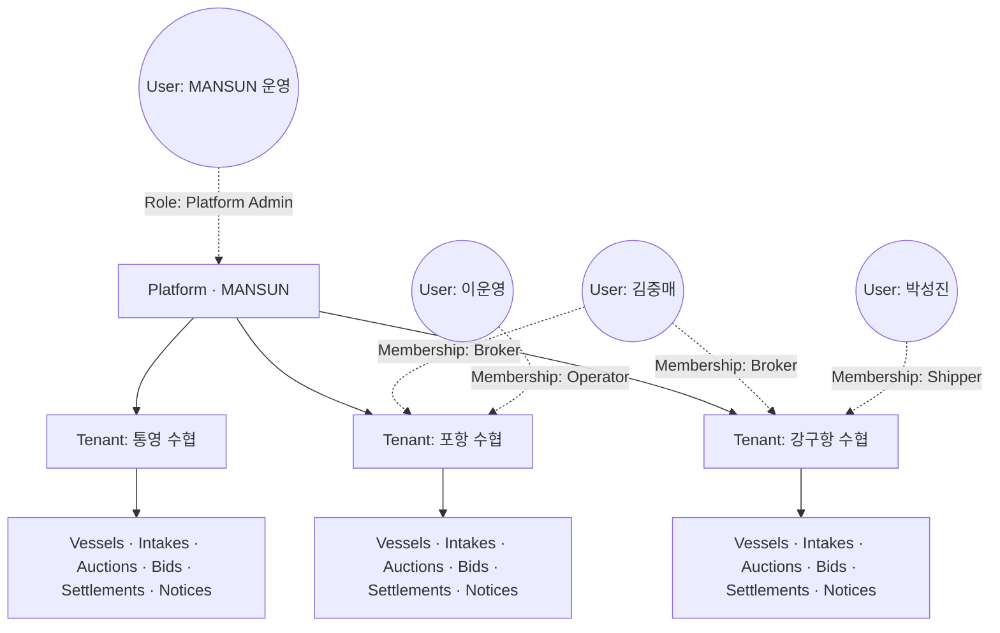

# 00. 멀티 수협(다중 테넌트) 설계 개요

## 목적

MANSUN을 **여러 수협이 같은 플랫폼을 공유하면서도 데이터·운영은 독립적으로 진행할 수 있도록** 확장한다.
현재 목업은 단일 위판장(강구항 가정)으로 구성되어 있고, 코드를 작성하기 전에 멀티테넌트 아키텍처의 청사진을 먼저 정리하는 문서 묶음이다.

## 범위

| 포함 | 미포함 |
|------|-------|
| 데이터 모델·격리 전략 | 특정 DB/언어/프레임워크 선정 |
| 사용자·역할·권한 모델 | 인프라(클라우드/온프레미스) 결정 |
| 수협 등록·정지 라이프사이클 | 결제/회계 시스템 연동 상세 |
| 신규 화면 + mockup 변경점 | UI 디자인 시스템 |
| mockup → 멀티테넌트 마이그레이션 단계 | 성능·SLA 수치 |

## 핵심 결정 요약

| 영역 | 결정 | 근거 |
|------|------|------|
| 테넌트 단위 | **수협 1개 = Tenant 1개** | 운영 주체·정산·면허 단위가 수협 |
| 데이터 격리 | **단일 DB, 모든 도메인 테이블에 `tenant_id` 강제** | 비용·관리 효율 vs 격리 강도의 균형 |
| 사용자 다중 소속 | **허용** (User × Tenant × Role을 Membership으로 매핑) | 중매인이 여러 위판장에서 면허 보유하는 현실 반영 |
| 신규 역할 | **Platform Admin** 추가 (MANSUN 자체 운영) | 수협 등록·정지 권한을 수협 내부 관리자와 분리 |
| 등록 절차 | **Platform Admin 직접 생성 → 수협 Admin 초청** (셀프 가입 X) | 면허·법적 책임을 확인한 후 활성화 |
| URL 라우팅 | **Path 기반 `/t/{tenant_code}/...`** | 운영 단순함, 도메인 인증서 1개로 충분 |
| 공유 마스터 | 어종 표준명·등급 코드만 공유 | 박스 중량·수수료율은 수협별로 다름 |

## 용어 정의

| 용어 | 정의 |
|------|------|
| **Platform** | MANSUN 서비스 자체. 모든 Tenant의 상위 계층 |
| **Tenant** | 개별 수협/위판장. 본 문서에서 "수협"과 동의어로 사용 |
| **User** | 글로벌 사용자 계정 (이메일/전화로 식별). Tenant 없이도 존재 가능 |
| **Membership** | User × Tenant × Role 의 관계. 한 User가 N개 Membership 보유 가능 |
| **Scope** | 권한 적용 범위 — `Platform` / `Tenant` / `Self` 중 하나 |
| **Active Tenant** | 현재 세션에서 사용자가 작업 중인 Tenant. 헤더 드롭다운으로 전환 |
| **Platform Admin** | Tenant를 생성·정지하는 MANSUN 측 운영자 |
| **수협 Admin** | 단일 Tenant 내 사용자/면허 관리자 (기존 요구사항 v0.3의 "관리자") |

## 계층 구조

- **Platform 레이어**: Tenant 마스터, Platform Admin 권한, 공유 마스터(어종 표준명 등)
- **Tenant 레이어**: 도메인 데이터 전부. `tenant_id`로 격리
- **User-Membership 그래프**: 한 User가 여러 Tenant에 동시 소속 가능

## 요구사항 v0.3과의 매핑

| 요구사항 § | 멀티테넌트 영향 | 해당 문서 |
|------------|----------------|----------|
| § 2 Role 정의 | 6개 역할 모두 Tenant 스코프로 재정의 + Platform Admin 신설 | `02-iam.md` |
| § 3 UC-01~08 | 모든 UC가 active tenant 컨텍스트 안에서 동작 | `04-ui-changes.md` |
| § 4 권한 매트릭스 | "스코프" 컬럼 추가하여 확장 | `02-iam.md` |
| § 5 시스템 고려 | 데이터 보존 의무 → 정지/아카이브 상태에서도 유지 | `03-tenant-lifecycle.md` |
| § 6 Phase 전략 | 멀티테넌트는 § 6 Phase와 직교 — 두 축 모두에서 단계 진행 가능 | `05-migration.md` |
| § 7 Action Items | 수협마다 정책이 다른 항목을 Tenant 설정으로 흡수 | `03-tenant-lifecycle.md`, `06-open-questions.md` |

## 문서 인덱스

| # | 파일 | 내용 |
|---|------|------|
| 00 | `00-overview.md` | 본 문서 |
| 01 | `01-domain-model.md` | 엔티티, 격리 전략, 식별자 |
| 02 | `02-iam.md` | 인증, 역할, 권한 매트릭스 |
| 03 | `03-tenant-lifecycle.md` | 등록·상태·설정 |
| 04 | `04-ui-changes.md` | 신규 화면 + mockup 변경점 |
| 05 | `05-migration.md` | mockup → 멀티테넌트 단계 |
| 06 | `06-open-questions.md` | 미결정 정책 |
| — | [`roles/`](roles/README.md) | **역할별 화면·기능 명세** (7개 역할 + README, 1,800+ 줄). 화면 수준 권한·인풋·시퀀스 흐름. |

---

**결정**: 본 문서의 "핵심 결정 요약" 표 모두 확정.
**Open**: 단계 전환 시점, SLA 모델, 회계 연동 상세는 `06-open-questions.md` 참조.
