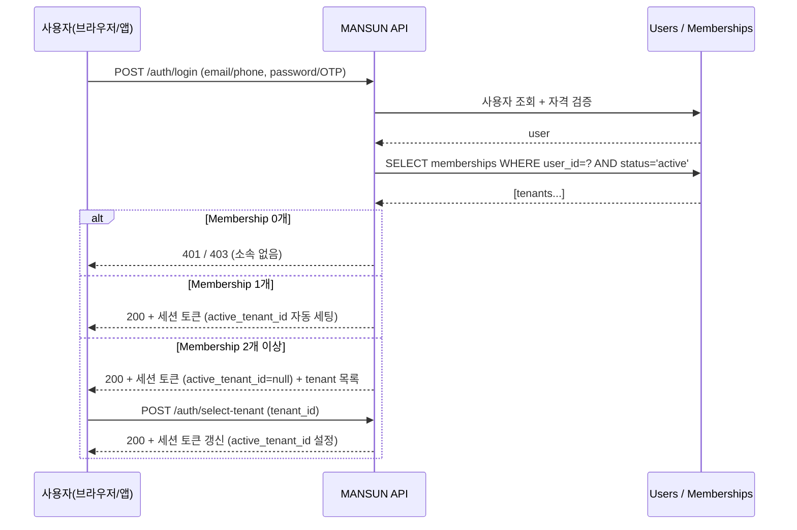

# 02. IAM (Identity & Access Management)

## 인증 흐름

### 세션/토큰

- 모든 인증 토큰(JWT 또는 세션)에 다음 필드 포함:
  - `user_id`
  - `active_tenant_id` (Platform Admin이면 null 허용)
  - `active_role` (Tenant 컨텍스트일 때)
  - `is_platform_admin` (boolean)
- 서버는 매 요청마다 `active_tenant_id` 를 ORM/DB 컨텍스트에 주입
- 토큰 유효기간: 만료 시 재발급 (refresh token)

### 본인 확인 2단계

| 단계 | 시점 | 수행 |
|------|------|------|
| 1차 — 글로벌 | 회원가입/초청 수락 시 | 이메일/전화 OTP, `users.identity_verified=TRUE` |
| 2차 — Tenant | Membership 가입 시 | 면허/사업자번호 확인 (수협 Admin 수동 승인) |
| 강한 인증 | 입찰 등 위험 행위 | OTP 또는 디바이스 바이오 인증 (요구사항 § 6.3 부정방지) |

## 역할 분류

### Platform 스코프

| 역할 | 권한 |
|------|------|
| **Platform Admin** | Tenant 등록·정지·아카이브, Tenant 설정 보기(쓰기 불가), 플랫폼 통계, 사용자 글로벌 정지 |

> Platform Admin은 도메인 데이터(입고/입찰/낙찰)는 **읽기 전용**이다. 분쟁 조사 등 필요 시에도 직접 수정 불가; Tenant Admin이 처리.

### Tenant 스코프 (기존 6역할)

요구사항 v0.3 § 2 의 6역할을 모두 Tenant 스코프로 재정의.

| 역할 | 키 | 비고 |
|------|----|------|
| 수협 Admin | `admin` | 단일 Tenant의 사용자·면허·설정 관리 |
| Operator | `operator` | 경매 진행·공지·개찰·정산 |
| Receiver | `receiver` | 입고 입력 (Operator와 겸임 가능) |
| Broker | `broker` | 입찰 (license_no 필수) |
| Shipper | `shipper` | 본인 출하/정산 조회 |
| Union | `union` | 노조 — 작업 일정 조회 |

## 권한 매트릭스

요구사항 v0.3 § 4 표를 **Scope 컬럼**과 **Platform Admin 컬럼**을 추가하여 확장.

| 기능 | Scope | P.Admin | T.Admin | Op | Recv | Brk | Ship | Union |
|------|:-----:|:-------:|:-------:|:--:|:----:|:---:|:----:|:-----:|
| Tenant 등록/정지 | Platform | ✓ | - | - | - | - | - | - |
| Tenant 설정 보기 | Platform | ✓(R) | ✓ | - | - | - | - | - |
| Tenant 설정 변경 | Tenant | - | ✓ | - | - | - | - | - |
| 사용자/면허 관리 | Tenant | - | ✓ | - | - | - | - | - |
| 입고 등록/수정 | Tenant | - | ✓ | ✓ | ✓ | - | - | - |
| 공지 발송 | Tenant | - | ✓ | ✓ | - | - | - | - |
| 공지 수신 | Tenant | - | ✓ | ✓ | ✓ | ✓ | ✓ | ✓ |
| 입찰 | Tenant | - | - | - | - | ✓ | - | - |
| 본인 입찰 내역 | Self | - | ✓ | ✓ | - | ✓(Self) | - | - |
| 전체 입찰 내역 | Tenant | - | ✓ | ✓ | - | - | - | - |
| 개찰 실행 | Tenant | - | ✓ | ✓ | - | - | - | - |
| 본인 낙찰 결과 | Self | - | ✓ | ✓ | - | ✓(Self) | ✓(Self) | - |
| 전체 낙찰 결과 | Tenant | - | ✓ | ✓ | - | - | - | - |
| 정산 처리 | Tenant | - | ✓ | ✓ | - | - | - | - |
| 본인 정산 조회 | Self | - | ✓ | ✓ | - | ✓(Self) | ✓(Self) | - |
| 입고/경매 일정 조회 | Tenant | - | ✓ | ✓ | ✓ | ✓ | ✓ | ✓ |
| 통계/리포트 | Tenant | ✓(R, 집계) | ✓ | ✓ | - | △(Self) | △(Self) | △(작업량) |
| 플랫폼 통계 | Platform | ✓ | - | - | - | - | - | - |
| 글로벌 사용자 정지 | Platform | ✓ | - | - | - | - | - | - |
| 감사 로그 조회 | Tenant | ✓(R) | ✓ | - | - | - | - | - |

기호:
- `✓`: 쓰기/실행 가능 · `✓(R)`: 읽기 전용 · `△`: 제한 범위(본인/작업분만) · `-`: 권한 없음
- `Self`: Membership 보유자 본인 데이터에 한정

> **화면 수준 권한 매트릭스**는 [`roles/README.md`](roles/README.md#역할--화면-매트릭스) 참조. 본 표가 "기능 × 역할" 이라면 그 매트릭스는 "URL/화면 × 역할" 로, 두 시각이 상호 보완한다.

## 활성 테넌트 전환

### 단일 소속자

- 로그인 직후 자동 진입. 헤더에 현재 Tenant 이름 표시. 드롭다운에 다른 Tenant 없음.

### 다중 소속자

- 로그인 직후 **수협 선택 화면** (`04-ui-changes.md` 참조)
- 작업 중 헤더 드롭다운으로 전환 가능. 전환 시:
  1. 현재 페이지에서 작성 중인 폼 데이터가 있으면 경고 모달
  2. 세션의 `active_tenant_id` 갱신 → 토큰 재발급
  3. 동일 의미의 페이지로 리다이렉트 (예: 강구항 대시보드 → 포항항 대시보드). 의미가 일치하지 않으면(역할이 다름) 새 Tenant의 기본 화면으로 이동
- 다중 소속자의 **글로벌 알림함**: 모든 Tenant의 알림이 통합 표시되되 Tenant 라벨 부착. 클릭 시 해당 Tenant로 전환

### Platform Admin 특수 케이스

- Platform Admin이 Tenant Membership도 보유한 경우: 헤더에 "Platform" 옵션이 추가됨. Platform 선택 시 Platform Console 진입
- Platform Admin이 도메인 데이터를 보려면 Tenant를 선택해서 진입하지만, 모든 쓰기 작업은 차단되고 상단에 "읽기 전용 (Platform Admin)" 배너 표시

## 정책 강제 메커니즘

1. **API 게이트웨이/미들웨어**: 모든 요청에 대해 토큰 검증 + `active_tenant_id` 컨텍스트 주입
2. **권한 데코레이터/가드**: 엔드포인트별 필요한 `(role, scope)` 선언 → 매트릭스 위반 시 403
3. **데이터 액세스 레이어**: `tenant_id` 자동 필터링. Self-scope는 추가로 `user_id` 필터링
4. **DB RLS**: 우회 차단의 마지막 방어선

## 감사 로그 (요약)

`01-domain-model.md` 의 감사 로그 모델 참조. IAM 관점에서 추가로 기록:

- 로그인 성공/실패
- Membership 생성·역할 변경·정지
- Active tenant 전환 (어떤 IP에서)
- Platform Admin의 모든 조회 (입고/입찰/낙찰 등 도메인 데이터 read도 기록)

---

**결정**:
- 단일 글로벌 User + Membership으로 다중 소속 지원
- Platform Admin은 도메인 데이터 읽기 전용
- 권한 매트릭스 확정 (위 표)

**Open**:
- 토큰 형식(JWT vs 세션)·refresh 정책 — 구현 시 결정
- 강한 인증(MFA)의 적용 범위 — 입찰만 vs 전 화면
- Platform Admin의 도메인 조회 시 감사 로그 — 범위와 보존 기간
