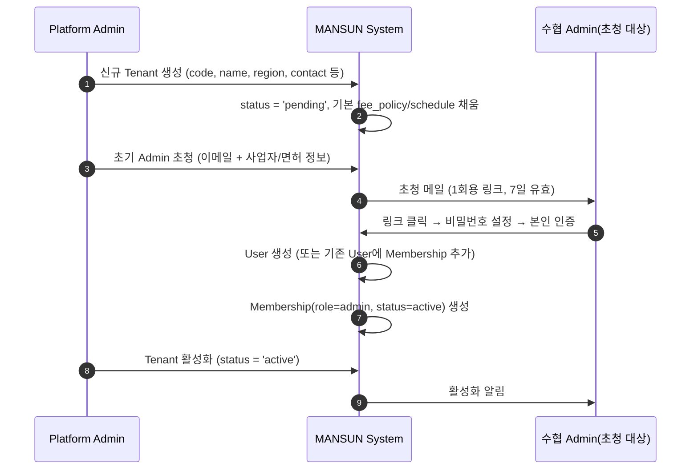
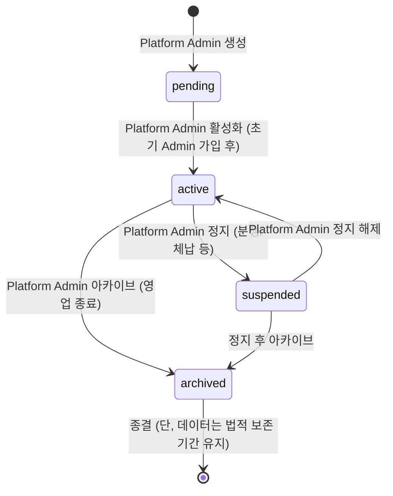

# 03. 수협(Tenant) 라이프사이클

## 등록 절차

**셀프 가입은 허용하지 않는다.** Platform Admin이 사전 검토 후 수동 생성한다.

1. **Platform Admin** 가 Tenant 메타데이터 입력 (code, name, region, 연락처)
2. 시스템이 Tenant를 `pending` 상태로 생성 + 기본 정책(`fee_policy`, `schedule` 등)을 템플릿에서 채움
3. Platform Admin 가 **초기 수협 Admin 1명** 을 이메일로 초청 (Tenant 활성화 전이라도 초청 가능)
4. 초청 대상이 가입을 완료하면 `Membership(role=admin, status=active)` 생성
5. Platform Admin 가 검토 후 Tenant `active` 전환 → 운영 시작
6. 이후 **수협 Admin** 가 자체적으로 Operator/Receiver/추가 Broker 등 멤버 관리

### 초기 수협 Admin 초청 시 입력 정보

| 항목 | 필수 | 비고 |
|------|------|------|
| 이름 | ✓ | 실명 |
| 이메일 | ✓ | 가입 링크 발송 |
| 전화번호 | ✓ | OTP |
| 직책 | △ | 예: 위판과장 |
| 사업자등록번호 | ✓ | 수협 사업자 |
| 면허/위판장 등록증 | △ | 첨부 파일 |

## 상태 머신

### 각 상태의 동작

| 상태 | 신규 입고 | 입찰 | 개찰 | 정산 | 조회 | 사용자 추가 | 비고 |
|------|:---------:|:----:|:----:|:----:|:----:|:-----------:|------|
| `pending` | ✗ | ✗ | ✗ | ✗ | ✓(Admin만) | ✓(초기 Admin만) | 활성화 전 준비 단계 |
| `active` | ✓ | ✓ | ✓ | ✓ | ✓ | ✓ | 정상 운영 |
| `suspended` | ✗ | ✗ | ✗ | ✗(기존 처리만 완료) | ✓ | ✗ | 사용자 로그인은 가능, 조회만 |
| `archived` | ✗ | ✗ | ✗ | ✗ | ✓(읽기 전용) | ✗ | 신규 Membership 차단 |

### 정지 → 활성 전환 가능 케이스

- 미해결 분쟁 종결
- 체납 정산 완료
- 면허 갱신 확인

### 아카이브 정책

- **데이터는 삭제하지 않는다** (요구사항 v0.3 § 5 데이터 보존)
- 법적 보존 기간 (예: 수산물 거래기록 5년 — `06-open-questions.md` 에서 확정 필요) 동안 읽기 전용 유지
- 보존 기간 종료 후의 처리는 별도 정책 — Platform Admin 가 명시적으로 실행 (자동 삭제 X)

## 수협별 설정 (Tenant 설정 페이지)

수협 Admin 가 자체적으로 편집할 수 있는 항목. 요구사항 v0.3 § 7 Action Items 중 수협마다 다른 항목을 본 영역으로 흡수.

| 분류 | 설정 항목 | 기본값 / 예시 | 비고 |
|------|-----------|---------------|------|
| **경매 일정** | 회차별 운영 시간표 | `[{회차: 1, 마감: '07:00'}, ...]` | 새벽/오전/오후 회차 |
| **디지털 마감** | 디지털 마감 ~ 현장 시작 사이 분 | `5` 분 | 요구사항 § 6.3 |
| **동일가 처리** | `first_come` / `lottery` / `split` / `rebid` | `first_come` | § 7 Action Item |
| **디지털가 공개 정책** | `hidden` / `auctioneer_only` / `public` | `hidden` | 요구사항 § 6.3 옵션 A/B/C |
| **입찰 수정 허용** | `true` / `false` | `true` | § 7 |
| **최저가(예가)** | 어종별 최저 단가 | 어종별 JSON | § 7 |
| **단위 환산** | 어종별 박스/마리 표준 중량 | `{갈치: 20kg/박스, ...}` | § 7 |
| **수수료** | 위판수수료율 / 중매인수수료율 / VAT | `0.04 / 0.015 / 0.10` | § 7 |
| **알림 채널** | 인앱/SMS/알림톡 발신 자격증명 | Tenant 사업자번호 묶음 | § 7 |
| **회계 연동** | 수협 회계 시스템 API endpoint·키 | 옵션 | § 7 (없으면 수동 정산서 출력) |

### 설정 변경 정책

- 수협 Admin 만 변경 가능 (Operator도 변경 불가 — 입찰 정책 조작 위험)
- 모든 변경은 감사 로그 기록 (변경 전/후 값)
- 일부 설정은 **활성 경매 진행 중에는 변경 불가** (예: 동일가 처리, 수수료율). 다음 회차부터 적용
- 변경 시 영향 받는 사용자에게 사전 공지 옵션 (수수료율 변경 시 중매인에게 자동 알림)

## 데이터 보존과 아카이브

| 데이터 | 보존 | 사유 |
|--------|------|------|
| 입찰 이력, 낙찰 결과 | **영구** | 요구사항 § 5 분쟁 대비 |
| 정산서 | **영구** | 법정 회계 기록 |
| 감사 로그 (도메인 + IAM) | **영구** | 부정 추적 |
| Tenant 설정 변경 이력 | **영구** | 분쟁 시 당시 정책 재구성 |
| 사용자 본인 정보(이메일/전화) | Tenant 아카이브 후 5년 (`06-open-questions.md` 확정 필요) | 개인정보 보호법 |

---

**결정**:
- 셀프 가입 불허, Platform Admin 직접 생성
- 4단 상태 머신 (`pending → active → suspended → archived`)
- 수협별 설정 항목 위 표 확정

**Open**:
- 법적 보존 기간 정확한 수치 (수산물 거래 / 위판 거래 관련 법령 확인 필요)
- 정지 해제 가능 여부의 SLA / 절차 — Platform Admin 단독 결정 vs 위원회 결정
- 아카이브 후 데이터 익명화(PII 제거) 정책
