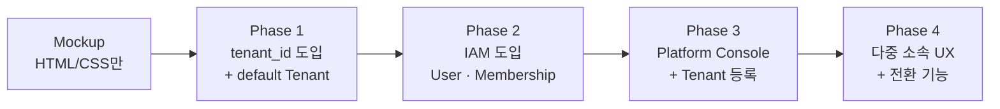

# 05. 마이그레이션 — mockup → 멀티테넌트 구현

## 전체 흐름



각 Phase는 **독립적으로 배포 가능**해야 하며, 다음 Phase로 넘어가지 못한 상태에서도 운영 중단 없이 동작해야 한다.

> 본 마이그레이션은 요구사항 v0.3 § 6 (온·오프라인 병행 도입 Phase 1~3)과 **직교**한다. 두 축에서 동시에 진행 가능.

## Phase 1 — 단일 테넌트 정상 동작 + tenant_id 인프라

### 목표
실서비스에서는 여전히 1개 수협만 운영하지만, 데이터 모델·코드·DB에 멀티테넌트의 기초 구조를 미리 깔아 둔다.

### 작업 범위
- [ ] 모든 도메인 테이블에 `tenant_id` 컬럼 추가 (`NOT NULL`)
- [ ] `tenants` 테이블 생성 + `default` Tenant 1개 시드
  - `code='default'`, `name='강구항 수협'`, `status='active'`, 현재 mockup 가정값으로 fee_policy 등 채움
- [ ] 기존 모든 데이터의 `tenant_id` 를 default Tenant id로 백필
- [ ] 데이터 액세스 레이어에 `tenant_id` 자동 필터링 도입 — 단, 이 단계에선 default 1개만 존재하므로 영향 없음
- [ ] DB RLS 활성화 (옵션 — Phase 2 와 묶어도 됨)
- [ ] 식별자 규약 적용: 경매번호 형식을 `default-YYYYMMDD-{회차}{seq}` 로 변경

### 비범위
- 사용자 모델 변경 X (현행 단일 테넌트 사용자 그대로)
- URL 변경 X (mockup의 `/operator/dashboard.html` 형태 유지)

### 리스크
| 리스크 | 완화 |
|--------|------|
| 백필 시 누락된 레코드 → NULL `tenant_id` | 마이그레이션 트랜잭션 + 후처리 검증 쿼리 |
| RLS 활성화 후 기존 쿼리 실패 | 스테이징에서 전체 회귀 테스트 |
| 경매번호 형식 변경으로 외부 시스템 영향 | 회계 연동 키 변경 — 사전 통보 |

### 검증
- 단일 수협으로 모든 UC-01~08 정상 동작
- DB에 `tenant_id IS NULL` 인 행 0건
- 모든 쿼리에 `tenant_id` 필터 강제 (정적 분석 또는 EXPLAIN으로 확인)

## Phase 2 — IAM (User · Membership · 인증)

### 목표
글로벌 User + Tenant Membership 모델 도입. 인증 흐름 분리.

### 작업 범위
- [ ] `users`, `memberships`, `platform_admins` 테이블 생성
- [ ] 기존 사용자 데이터를 User + Membership 으로 분리 (default Tenant 한정)
- [ ] 로그인 API 변경 — 토큰에 `active_tenant_id`, `active_role` 포함
- [ ] 권한 미들웨어/가드 도입 — 매트릭스 기반 (`02-iam.md`)
- [ ] 감사 로그 IAM 이벤트 기록 시작
- [ ] 초청 흐름(Membership 초청 메일·OTP) 구현

### 비범위
- Platform Console UI 없음 — `pending` Tenant 생성은 DB 직접 또는 관리 스크립트
- 다중 소속자 UX 없음 — 모든 사용자가 default Tenant 단일 소속이므로 무관

### 리스크
| 리스크 | 완화 |
|--------|------|
| 기존 사용자 비밀번호 마이그레이션 | 일괄 재설정 메일 발송 |
| 권한 매트릭스 누락으로 기능 차단 | 매트릭스 표를 코드 enum 으로 단일 출처화 |
| 토큰 형식 변경으로 모든 클라이언트 재로그인 필요 | 사용자 사전 공지 |

### 검증
- 기존 운영자/중매인의 로그인·기능 정상
- 권한 매트릭스 위반 시도 403 확인 (자동 테스트)
- 감사 로그에 로그인·Membership 변경 이벤트 기록

## Phase 3 — Platform Console + Tenant 등록 흐름

### 목표
Platform Admin 이 신규 수협을 등록·정지할 수 있게 함. 단, 실제 새 수협 운영 개시는 Phase 4 이후.

### 작업 범위
- [ ] Platform Admin 역할 부여 (운영팀 1~2명)
- [ ] Platform Console UI (`04-ui-changes.md` 신규 화면 3)
  - Tenant 목록 / 등록 / 상세 / 정지·활성화
- [ ] Tenant 생성 API + 초기 Admin 초청 흐름
- [ ] Tenant 상태 머신 강제 (`03-tenant-lifecycle.md`)
- [ ] 수협 설정 페이지 (수협 Admin 용) — `fee_policy`, `box_weight_table` 등 편집 UI
- [ ] 정산·개찰 코드에서 하드코딩된 정책을 Tenant 설정으로 치환

### 비범위
- 다중 소속 사용자 UX 없음 (Phase 4)
- 외부 회계 시스템 연동 변경 (별도 트랙)

### 리스크
| 리스크 | 완화 |
|--------|------|
| 신규 Tenant 생성 후 활성화 전에 데이터 유입 | `pending` 상태에서 모든 도메인 쓰기 차단을 가드로 강제 |
| 수협 Admin 의 설정 실수로 운영 중단 (예: 박스 중량 0) | 변경 시 유효성 검증 + 활성 경매 중 변경 차단 |
| 정산 수수료율 변경의 회귀 | 정산 자동 테스트에 Tenant별 fee_policy 케이스 추가 |

### 검증
- 신규 Tenant 등록 → 초기 Admin 초청 → 가입 → 활성화 end-to-end
- 정산서가 Tenant `fee_policy` 에 따라 동적으로 계산됨
- `suspended` 상태에서 입찰/입고 시도 → 403

## Phase 4 — 다중 소속 사용자 UX

### 목표
한 사용자가 여러 Tenant에 소속될 수 있고, 헤더에서 자유롭게 전환할 수 있다.

### 작업 범위
- [ ] 수협 선택 화면 (`/select-tenant`)
- [ ] 헤더 `<TenantSwitcher>` 컴포넌트
- [ ] 토큰 재발급 흐름 (전환 시 `active_tenant_id` 갱신)
- [ ] URL 라우팅 `/t/{code}/...` 도입 — 기존 mockup 경로에서 마이그레이션
- [ ] 다중 Tenant 알림 통합함 (글로벌 알림함)
- [ ] mockup 페이지를 Tenant 컨텍스트 인식하도록 리팩토링

### 비범위
- 즐겨찾기 Tenant, 알림 필터 등 편의 기능 — 별도 트랙

### 리스크
| 리스크 | 완화 |
|--------|------|
| URL 변경으로 기존 북마크 깨짐 | 구 경로 → 신 경로 301 리다이렉트 (default Tenant 자동 매핑) |
| 전환 중 데이터 노출 (race condition) | 모든 쿼리에서 토큰 내 `active_tenant_id` 만 신뢰 — URL `code` 와 불일치 시 즉시 갱신 |
| 다중 Tenant 사용자의 비밀번호 정책 차이 | 글로벌 정책으로 통일 (User 레벨) |

### 검증
- 다중 소속 시나리오 e2e: 강구·포항 동시 소속자가 입찰 후 결과 통합 확인
- 단일 소속자는 전환 UI 표시 안 됨
- URL `/t/{code}/...` 의 `code` 와 토큰 불일치 시 자동 갱신 또는 403

## 데이터 마이그레이션 체크리스트 (Phase 1)

```sql
-- 1. tenants 테이블 + default 시드
INSERT INTO tenants (id, code, name, region, status, fee_policy, ...)
VALUES (gen_random_uuid(), 'default', '강구항 수협', '경상북도', 'active', '{...}', ...);

-- 2. 각 도메인 테이블에 tenant_id 추가
ALTER TABLE intakes      ADD COLUMN tenant_id UUID;
ALTER TABLE auctions     ADD COLUMN tenant_id UUID;
ALTER TABLE bids         ADD COLUMN tenant_id UUID;
-- ... (vessels, auction_results, settlements, notices 등)

-- 3. default Tenant 로 백필
UPDATE intakes  SET tenant_id = (SELECT id FROM tenants WHERE code='default') WHERE tenant_id IS NULL;
-- ... 모든 테이블 반복

-- 4. NOT NULL + FK 강제
ALTER TABLE intakes ALTER COLUMN tenant_id SET NOT NULL;
ALTER TABLE intakes ADD CONSTRAINT fk_intakes_tenant FOREIGN KEY (tenant_id) REFERENCES tenants(id);
-- ... 모든 테이블 반복

-- 5. 식별자 재배정 (경매번호 등) — 필요 시
```

각 Phase의 시작 전 **스테이징 환경 회귀 테스트 통과**가 전제 조건.

---

**결정**:
- 4 Phase 구조, 각 Phase 독립 배포 가능
- Phase 1 에서 default Tenant 시드 후 점진 전환
- 요구사항 § 6 Phase와 직교

**Open**:
- 각 Phase의 예상 일정 — 인력·우선순위에 따라 조정
- Phase 1 ~ 2 사이 다운타임 허용 여부 (DB 마이그레이션 시간)
- 외부 회계 시스템 연동의 마이그레이션 동기화 시점
