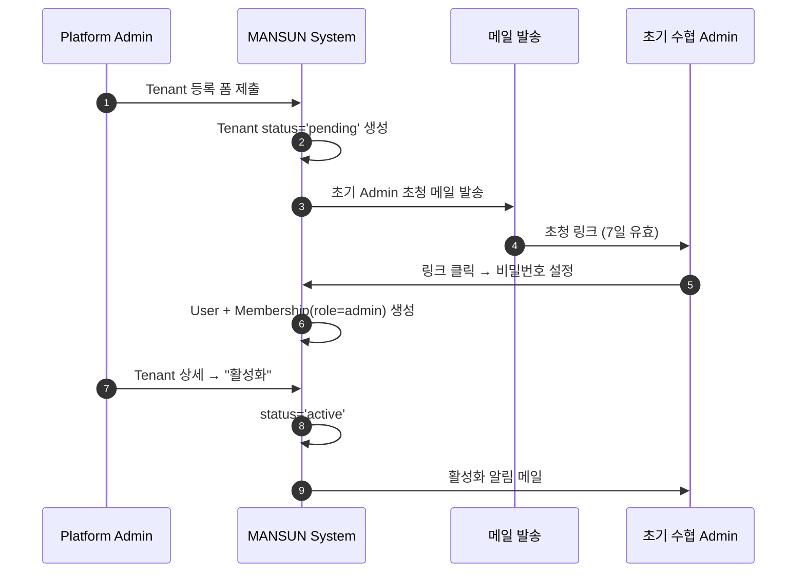
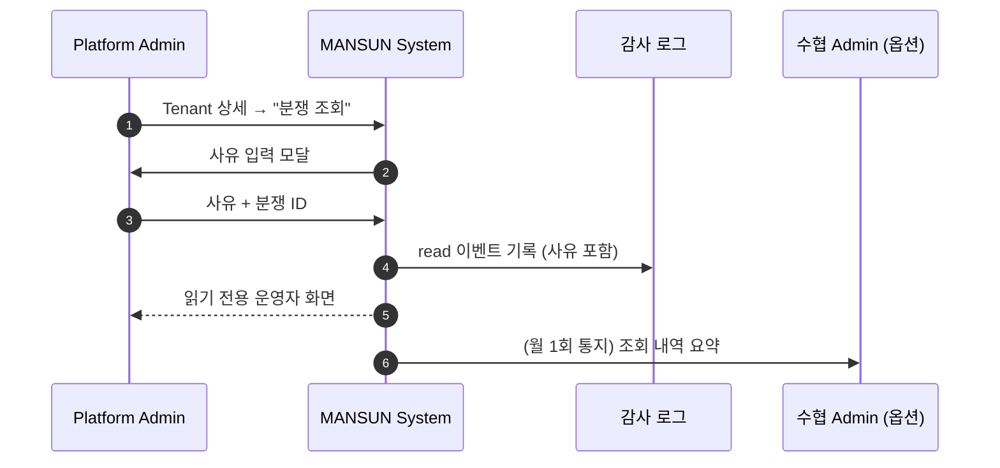

# 00. Platform Admin (플랫폼 운영자)

## 요약

- **정의**: MANSUN 플랫폼 자체를 운영하는 내부 인력 (수협이 아닌 MANSUN 측 직원)
- **권한 스코프**: `Platform` — 모든 Tenant에 걸치되, **도메인 데이터는 읽기 전용**
- **디바이스**: 데스크톱 (수협 등록·정지가 위험 행위이므로 PC 환경 강제)
- **인원 규모**: 매우 소수 (1~3명) 가정. 부여는 별도 `platform_admins` 테이블 ([`design/01-domain-model.md`](../01-domain-model.md#platform-admin-별도-모델))

## 책임과 권한

### 할 수 있는 것
- 신규 Tenant 등록·활성화·정지·아카이브
- 초기 수협 Admin 1명 초청 (Tenant 활성화의 전제)
- 글로벌 사용자 검색·정지
- 플랫폼 전체 통계 조회 (Tenant 간 비교)
- 플랫폼·Tenant 감사 로그 열람
- Tenant 설정 조회 (변경은 불가)
- 도메인 데이터(입고/입찰/낙찰/정산) **읽기** — 분쟁 조사 시. **사유 입력 강제**

### 못 하는 것
- 도메인 데이터 수정·삭제 (Tenant Admin 또는 Operator 가 처리)
- Tenant 설정 변경 (수협 Admin 권한)
- 입찰·정산 등 운영 행위
- 자신을 포함한 Platform Admin 의 부여·회수 (별도 SOP 필요)

## 유스케이스 매핑

| UC | 본 역할의 관여 |
|----|----------------|
| UC-07 사용자/권한 관리 | **Tenant 등록·정지** (수협 Admin 의 UC-07이 Tenant 내부 관리라면, 본 역할은 Tenant 자체의 라이프사이클) |
| UC-08 통계/리포트 | 플랫폼 전체 집계 |
| (모든 UC) | 도메인 데이터 읽기 전용 조회 — 분쟁 발생 시 |

## 화면 목록

| 화면 | URL | 진입 조건 |
|------|-----|-----------|
| 플랫폼 대시보드 | `/platform` | `is_platform_admin=true` |
| Tenant 목록 | `/platform/tenants` | 동일 |
| Tenant 등록 | `/platform/tenants/new` | 동일 |
| Tenant 상세 | `/platform/tenants/{code}` | 동일 |
| 글로벌 사용자 검색 | `/platform/users` | 동일 |
| 사용자 상세 | `/platform/users/{user_id}` | 동일 |
| 플랫폼 통계 | `/platform/stats` | 동일 |
| 플랫폼 감사 로그 | `/platform/audit-logs` | 동일 |

**모두 [mockup 없음 — 구현 필요]**

## 각 화면 상세

### 플랫폼 대시보드

**진입 경로**: 로그인 직후, `is_platform_admin=true` 면 `/select-tenant` 에서 "Platform" 옵션 → `/platform`

**표시 데이터**
- KPI: 활성 Tenant 수 / 정지 / 아카이브 / 전체
- KPI: 오늘 전체 거래 건수, 거래 금액
- 최근 Tenant 등록 추이 (7일/30일)
- 정지 상태 Tenant 알림 카드 (사유·기간)
- 분쟁 조회 요청 큐 (수협이 Platform Admin 에게 조사 요청한 건)

**가능한 액션**: 각 KPI 카드 클릭 → 해당 목록으로 이동, "신규 Tenant 등록" 버튼

**입력 필드**: 없음 (조회 전용)

### Tenant 목록

**진입 경로**: 대시보드 → KPI 카드 또는 사이드바 메뉴

**표시 데이터** (테이블)

| 컬럼 | 비고 |
|------|------|
| code | URL 식별자 (gangu, pohang…) |
| 이름 | 강구항 수협 |
| 지역 | 광역시·도 |
| 상태 | pending / active / suspended / archived |
| 활성 사용자 수 | Membership status=active |
| 오늘 거래 건수 | active 한정 |
| 활성화일 | activated_at |
| 액션 | 상세 보기 · 정지 · 활성화 · 아카이브 |

**가능한 액션**
- 검색·필터 (상태별)
- 행 클릭 → 상세
- **⚠ 정지**: 사유 입력 모달 → 확인 → 상태 `suspended`
- **활성화**: `suspended` → `active`
- **⚠ 아카이브**: 사유 입력 + 보존 기간 표시 → 확인

**입력 필드** (정지 모달)

| 필드 | 타입 | 필수 | 검증 | 예시 |
|------|------|------|------|------|
| 사유 | text | ✓ | 10자 이상 | "체납 정산 미해결" |
| 정지 기간 | enum | ✓ | `7d`/`30d`/`무기한` | 30d |
| 통지 대상 | enum (multi) | ☐ | 모두/Admin만/없음 | 모두 |

### Tenant 등록

**진입 경로**: 대시보드 또는 목록의 "신규 Tenant 등록" 버튼

**가능한 액션**: 폼 작성 → "생성" → `pending` 상태로 생성 → 초기 Admin 초청

**입력 필드**

| 필드 | 타입 | 필수 | 검증 | 예시 |
|------|------|------|------|------|
| code | text | ✓ | 영소문자·영숫자 3~12자, 유니크 | gangu |
| 이름 | text | ✓ | 2~40자 | 강구항 수협 |
| 지역 | text | ✓ | 광역시·도 | 경상북도 |
| 사업자등록번호 | text | ✓ | 10자리 | 1234567890 |
| 위판장 주소 | text | ✓ | — | 영덕군 강구면 ... |
| 연락 이메일 | email | ✓ | — | admin@gangu.com |
| 연락 전화 | phone | ✓ | — | 054-xxx-xxxx |
| **초기 Admin 이름** | text | ✓ | — | 김위판 |
| **초기 Admin 이메일** | email | ✓ | — | kim@gangu.com |
| 위판장 등록증 | file (PDF) | ☐ | 10MB 이하 | — |

**출력/응답**
- 성공: Tenant `pending` 상태 생성 + 초기 Admin 이메일 발송 → "초청 메일 발송됨" 메시지 + Tenant 상세로 이동
- 실패: code 중복 → 인라인 에러

### Tenant 상세

**표시 데이터**
- 메타: code, 이름, 지역, 상태, 활성화일, 사업자번호
- 현재 설정 (`fee_policy`, `box_weight_table`, `tie_break_policy` 등) — **읽기 전용**, [`design/03-tenant-lifecycle.md`](../03-tenant-lifecycle.md#수협별-설정-tenant-설정-페이지) 의 항목과 동일 구조
- Membership 목록 (역할별 카운트)
- 최근 30일 거래량 추이 (스파크라인)
- 최근 감사 로그 (10건)

**가능한 액션**
- 상태 전이 (정지/활성화/아카이브)
- "감사 로그 전체 보기" → `/platform/audit-logs?tenant_code={code}`
- "분쟁 조회 모드 진입" (도메인 데이터 읽기) → 사유 입력 모달 → 읽기 전용 운영자 화면

**입력 필드** (분쟁 조회 모드)

| 필드 | 타입 | 필수 | 검증 | 예시 |
|------|------|------|------|------|
| 조회 사유 | text | ✓ | 20자 이상 | "민원 #M-2026-0042 입찰 이력 확인" |

### 글로벌 사용자 검색 / 사용자 상세

- 검색: 이름·이메일·전화
- 다중 소속자는 모든 Tenant Membership 표시 (각 Tenant 의 면허번호·역할·상태)
- 액션: **⚠ 글로벌 정지** (모든 Tenant 의 Membership을 일괄 `suspended`)

### 플랫폼 통계

- Tenant 간 비교: 일/월별 거래량·낙찰 단가 추이
- Top N: 활성 사용자, 거래액
- CSV 내보내기

### 플랫폼 감사 로그

- 모든 Tenant 의 IAM·Tenant 라이프사이클 이벤트
- [`README.md`](README.md#auditlogtable) 의 `<AuditLogTable>` 공통 컴포넌트 사용
- Platform Admin 본인의 도메인 데이터 조회 이력도 포함

## 상호작용 흐름

### Tenant 신규 등록 ~ 활성화

### 분쟁 조회 모드 진입

## 알림 수신

| 이벤트 | 채널 | 트리거 |
|--------|------|--------|
| 초기 Admin 초청 만료 임박 | 인앱 | 만료 1일 전 |
| Tenant 활성화 완료 | 인앱 | TA 가입 완료 시 |
| 분쟁 조회 요청 | 인앱 + 이메일 | T.Admin 가 요청 |
| 시스템 헬스 알림 (다운 등) | 별도 인프라 채널 | 본 명세 범위 밖 |

## 데이터 가시성

- Tenant 메타·설정: 전체 Tenant 읽기
- 도메인 데이터: 분쟁 조회 모드 진입 시에만 읽기. 모든 read 가 감사 로그 기록
- 사용자 PII: 검색·정지 위해 필요한 최소 범위만

## Open

- 분쟁 조회 시 사유의 최소 길이·승인 워크플로우 ([`06-open-questions.md`](../06-open-questions.md#e2-platform-admin-의-도메인-데이터-조회-정책))
- 글로벌 사용자 정지의 다중 Tenant 영향 안내 UX
- Platform Admin 권한 회수 SOP (4-eye 원칙 필요?)

---

**결정**: 화면 8개·각 화면 액션·입력 필드 위 표.
**Open**: 위 절 + `06-open-questions.md` 참조.
