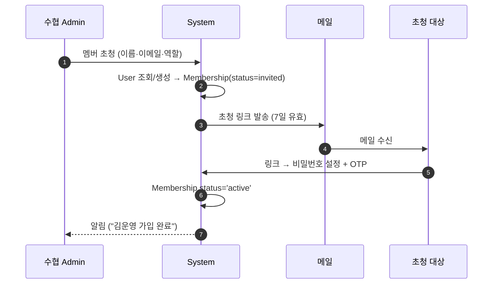
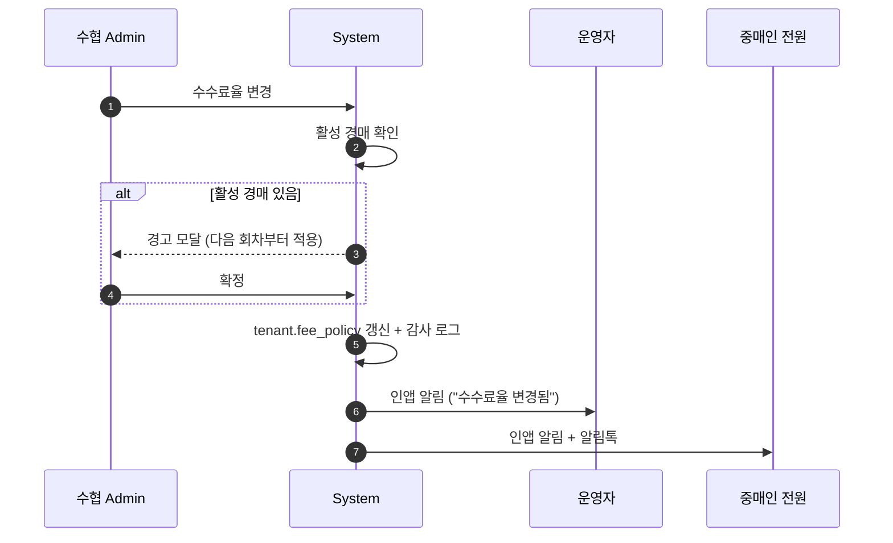

# 01. 수협 Admin (Tenant 관리자)

## 요약

- **정의**: 단일 수협(Tenant) 내부의 시스템 책임자. 위판장의 IT 담당 또는 행정 관리자
- **권한 스코프**: `Tenant` — 자신이 소속된 Tenant 한정 (다른 Tenant 데이터 접근 불가)
- **디바이스**: 데스크톱 중심 (사용자·면허 관리에 입력 분량 많음)
- **요구사항 v0.3 § 2 의 "관리자(Admin)"** 와 동일 역할. 멀티테넌트 도입으로 Tenant 스코프로 재정의

## 책임과 권한

### 할 수 있는 것
- 자신의 Tenant 의 모든 설정 (`fee_policy`, `box_weight_table`, 운영 시간표 등) 편집
- 사용자/Membership 관리: 운영자·입고담당·중매인·선주·노조 초청 및 정지
- 중매인 면허 등록·갱신·정지
- 선주 등록
- Tenant 감사 로그 조회
- 통계/리포트 전체 조회

### 못 하는 것
- 다른 Tenant 데이터 접근
- Tenant 자체의 정지·아카이브 (Platform Admin 권한)
- 도메인 운영 행위(입고/공지/개찰/정산) — Operator 가 수행 (단, Admin이 Operator 겸임 가능)
- 활성 경매 진행 중 일부 설정(수수료율·동일가 처리) 변경 — 다음 회차부터 적용

## 유스케이스 매핑

| UC | 본 역할의 관여 |
|----|----------------|
| UC-07 사용자/권한 관리 | **주관** — 중매인 면허, 선주 등록, Membership 관리 |
| UC-08 통계/리포트 | 전체 조회 |
| UC-02 ~ UC-06 | 정책 설정 단계에서만 (실행은 Operator) |

## 화면 목록

| 화면 | URL | 진입 조건 | mockup |
|------|-----|-----------|--------|
| Admin 대시보드 | `/t/{code}/admin` | `role=admin` | 없음 |
| 수협 설정 | `/t/{code}/admin/settings` | 동일 | 없음 |
| 사용자/멤버 관리 | `/t/{code}/admin/members` | 동일 | 없음 |
| 중매인 면허 관리 | `/t/{code}/admin/brokers` | 동일 | 없음 |
| 선주 등록 | `/t/{code}/admin/shippers` | 동일 | 없음 |
| 감사 로그 | `/t/{code}/admin/audit-logs` | 동일 | 없음 |
| 통계/리포트 | `/t/{code}/admin/stats` | 동일 | 없음 |

## 각 화면 상세

### Admin 대시보드

**표시 데이터**
- KPI: 활성 사용자 수 (역할별), 오늘 거래 건수, 미결 정산, 만료 임박 면허 수
- 최근 활동: 사용자 가입·역할 변경·면허 등록 (10건)
- 알림: 경고(예: 면허 7일 내 만료 5건)

**가능한 액션**: KPI 카드 → 해당 화면, "사용자 초청" 빠른 액션

### 수협 설정 (탭 6개)

**진입 경로**: 사이드바 → "설정"

**탭 구성**

| 탭 | 내용 |
|----|------|
| 일반 | 수협 이름·연락처·로고 등 표시 정보 |
| 경매 정책 | 디지털 마감 N분, 동일가 처리, 디지털가 공개, 입찰 수정 허용, 최저가(예가) |
| 단위 환산 | 어종별 박스/마리 표준 중량 |
| 수수료 | 위판수수료율·중매인수수료율·VAT |
| 알림 | 채널별 자격증명(알림톡 발신 프로필, SMS API key) |
| 회계 연동 | 회계 어댑터 선택·API endpoint·키 |

**입력 필드 (탭별 주요 항목)**

#### 경매 정책 탭

| 필드 | 타입 | 필수 | 검증 | 예시 |
|------|------|------|------|------|
| 디지털 마감 버퍼 | number(분) | ✓ | 1~30 | 5 |
| 동일가 처리 | enum | ✓ | first_come/lottery/split/rebid | first_come |
| 디지털가 공개 | enum | ✓ | hidden/auctioneer_only/public | hidden |
| 입찰 수정 허용 | boolean | ✓ | — | true |
| 최저가(예가) JSON | json | ☐ | 어종별 단가 객체 | {"고등어":5000} |

#### 수수료 탭

| 필드 | 타입 | 필수 | 검증 | 예시 |
|------|------|------|------|------|
| 위판수수료율 | number(%) | ✓ | 0~10, 0.1 단위 | 4.0 |
| 중매인수수료율 | number(%) | ✓ | 0~5, 0.1 단위 | 1.5 |
| VAT 포함 여부 | boolean | ✓ | — | true |

> 변경 시 활성 경매가 있으면 "다음 회차부터 적용됨" 경고 + 확인 모달.

**가능한 액션**: 탭별 "저장" 버튼. 변경 이력은 자동으로 감사 로그 기록.

### 사용자/멤버 관리

**표시 데이터** (테이블)

| 컬럼 | 비고 |
|------|------|
| 이름 | User.name |
| 역할 | admin/operator/receiver/broker/shipper/union |
| 면허번호 | Broker 한정 |
| 상태 | invited/active/suspended |
| 가입일 | joined_at |
| 마지막 활동 | last_login |
| 액션 | 역할 변경 · 정지 · 재초청 |

**필터**: 역할별, 상태별, 검색(이름·이메일·전화)

**가능한 액션**
- "+ 멤버 초청" → 모달
- 행 액션: 역할 변경, 정지, 재초청 (invited 만료 시)

**입력 필드** (초청 모달)

| 필드 | 타입 | 필수 | 검증 | 예시 |
|------|------|------|------|------|
| 이름 | text | ✓ | 2~20자 | 김운영 |
| 이메일 | email | ✓ | 형식 | kim@... |
| 전화 | phone | ☐ | 형식 | 010-... |
| 역할 | enum | ✓ | 6개 중 | operator |
| 면허번호 | text | role=broker 시 ✓ | Tenant 내 유니크 | M-201 |

### 중매인 면허 관리

**표시 데이터** (테이블)
- 면허번호·이름·연락처·발급일·만료일·상태(active/expired/suspended/revoked)
- 누적 낙찰 건수·금액
- 최근 활동 (입찰 일자)

**가능한 액션**
- "+ 면허 등록"
- 행 액션: **갱신** (만료일 연장 + 면허증 재발급), **정지** (사유 입력), **취소**(회복 불가)

### 선주 등록

**표시 데이터**: 선주 이름·연락처·소유 선박 목록·등록일

**가능한 액션**: "+ 선주 등록", 선박 추가

### 감사 로그 / 통계

- 공통 `<AuditLogTable>` ([`README.md`](README.md#auditlogtable))
- 통계: UC-08 — 일/월 어획량, 어종 단가 추이, 중매인 점유율, 선주별 실적

## 상호작용 흐름

### 멤버 초청

### 수수료율 변경 → 다음 회차 적용

## 알림 수신

| 이벤트 | 채널 | 트리거 |
|--------|------|--------|
| 멤버 가입 완료 | 인앱 | invited → active |
| 면허 만료 임박 (7일/3일/당일) | 인앱 + 이메일 | 스케줄러 |
| Platform Admin 의 도메인 조회 (월 요약) | 이메일 | 월 1회 |
| Tenant 정지 알림 (P.Admin이 발신) | 인앱 + 이메일 | P.Admin 액션 |
| 수수료율/박스 중량 변경 | (자기 액션이므로 발신만) | — |

## 데이터 가시성

- 자신의 Tenant 의 모든 데이터 (도메인·설정·감사)
- 다른 Tenant: 접근 불가
- Membership 의 다른 Tenant 정보: 본인이 그 Tenant 의 Admin 이면 별도 컨텍스트에서 조회

## Open

- 면허 만료 알림의 단계 정책 (7/3/1일 vs 다른 패턴) — Tenant 별 설정 가능 여부
- 초청 만료 7일 — Tenant 별 조정 허용?
- 선주의 자기 정보 변경 권한 — Admin 만 변경 vs 본인도 일부 변경

---

**결정**: 화면 7개, 탭 6개, 사용자 초청 흐름.
**Open**: 위 절.
