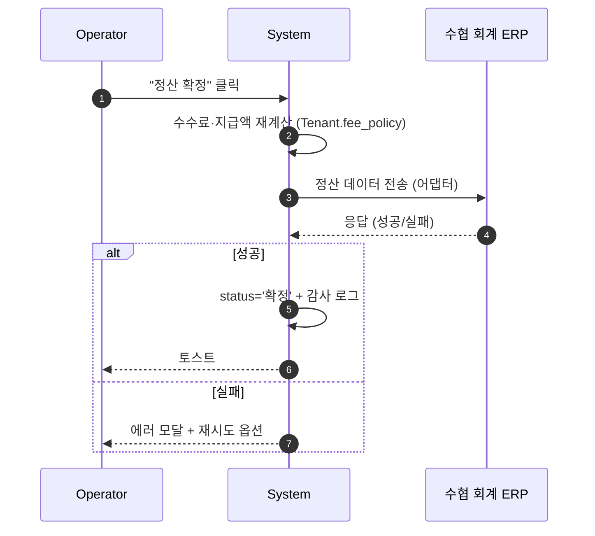
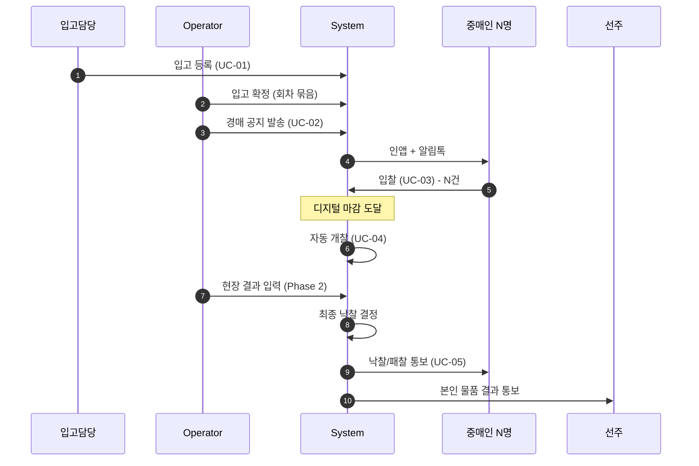
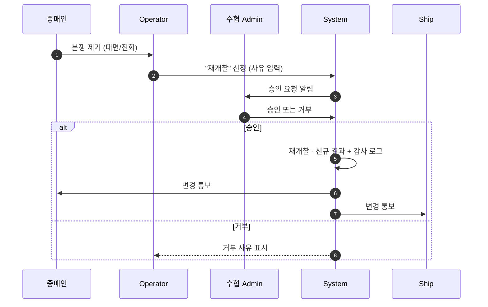
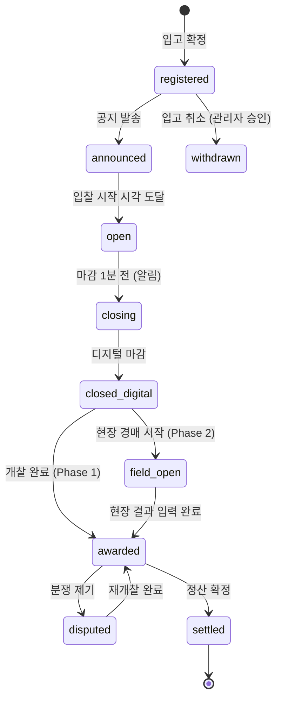

# 02. Operator (운영자)

## 요약

- **정의**: 위판장 현장에서 경매 진행 전 과정(입고 검수, 공지, 개찰, 정산)을 직접 수행하는 직원
- **권한 스코프**: `Tenant` — 소속 수협 운영 데이터 전체 쓰기
- **디바이스**: 데스크톱 (입력·테이블 중심). 입고 등록은 모바일 가능 (Receiver 와 겸임 시)
- **mockup**: 5개 페이지 모두 존재

## 책임과 권한

### 할 수 있는 것
- 입고 등록 (Receiver 와 겸임)
- 경매 공지 발송 (자동/수동)
- 개찰 실행 (자동 트리거 외 수동 가능)
- 현장 호가식 결과 입력 (Phase 2 운영 시)
- 정산서 생성·확정·회계 시스템 전송
- 전체 입찰 내역 조회 (감사용)
- 입고/경매 일정 조회, 통계

### 못 하는 것
- 수협 설정 변경 (수협 Admin 권한)
- 사용자/면허 관리 (Admin)
- 다른 Tenant 데이터 접근
- 본인이 입찰 참여 (이해 충돌 — 동일 사용자에게 operator + broker Membership 부여 금지)

## 유스케이스 매핑

| UC | 본 역할의 관여 |
|----|----------------|
| UC-01 입고 등록 | 주관 (Receiver 와 겸임) |
| UC-02 경매 공지 | **주관** — 자동 스케줄·수동 발송 |
| UC-04 개찰 | **주관** — 시스템 자동 외 수동 트리거 |
| UC-05 결과 통보 | 시스템 자동 + 대시보드 확인 |
| UC-06 정산 | **주관** — 정산서 생성·확정 |
| UC-08 통계/리포트 | 전체 조회 |

## 화면 목록

| 화면 | URL | mockup |
|------|-----|--------|
| 대시보드 | `/t/{code}/operator/dashboard` | `docs/operator/dashboard.html` |
| 입고 등록 | `/t/{code}/operator/intake` | `docs/operator/intake.html` |
| 경매 공지 | `/t/{code}/operator/notice` | `docs/operator/notice.html` |
| 개찰·결과 | `/t/{code}/operator/results` | `docs/operator/results.html` |
| 정산 | `/t/{code}/operator/settlement` | `docs/operator/settlement.html` |
| 입찰 내역 (전체) | `/t/{code}/operator/bids` | 없음 — 구현 필요 |
| 현장 결과 입력 | `/t/{code}/operator/field-result` | 없음 — Phase 2 운영 시 필요 |

## 각 화면 상세

### 대시보드 `[mockup: docs/operator/dashboard.html]`

**표시 데이터**
- KPI: 오늘 입고 건수, 진행중 경매, 오늘 낙찰 금액, 정산 대기
- 오늘 입항 선박 테이블: 도착시각·선박·선주·품목 수·총 중량·상태
- 최근 활동 로그

**가능한 액션**: KPI 카드 → 해당 화면, 테이블 행 → 입고 등록(해당 선박 컨텍스트로)

**입력 필드**: 없음 (조회 전용)

### 입고 등록 `[mockup: docs/operator/intake.html]`

**진입 경로**: 사이드바 또는 대시보드 → 선박 행

**표시 데이터**
- 선박 정보 (선박명·선주·도착 시각·경매 회차)
- 입고 품목 입력 폼
- 같은 선박의 입고 리스트 (이번 회차)

**가능한 액션**
- 선박 정보 자동 채움 (선박 마스터에서) 또는 수동 입력
- "+ 품목 추가" → 인라인 리스트 추가
- "삭제" — 미확정 품목만
- "전체 입고 확정" → 회차에 묶임, 이후 운영자 외 수정 불가 (수정은 감사 로그 + Admin 승인 필요)

**입력 필드** (품목)

| 필드 | 타입 | 필수 | 검증 | 예시 |
|------|------|------|------|------|
| 물탱크 번호 | text | ☐ | Tenant 내 회차 한정 유니크 권장 | T-01 |
| 어종 | select (공유 마스터) | ✓ | — | 고등어 |
| 중량 (kg) | number | ✓ | > 0 | 320 |
| 입찰 단위 | enum | ✓ | kg/box/ea | kg |
| 등급 | enum | ✓ | A/B/C | A |
| 참고사항 | text | ☐ | 100자 이내 | 활어 |
| 사진 | file (image, multi) | ☐ | 각 5MB 이하 | — |

### 경매 공지 `[mockup: docs/operator/notice.html]`

**가능한 액션**
- 자동/수동 모드 토글
- 발송 대상 선택 (중매인/노조/수협 직원/선주)
- 채널 선택 (인앱 푸시/카카오 알림톡/SMS)
- 안내 메시지 편집 (템플릿 + 자유 텍스트)
- "미리보기" / "📤 공지 발송"

**입력 필드**

| 필드 | 타입 | 필수 | 검증 | 예시 |
|------|------|------|------|------|
| 제목 | text | ✓ | 5~40자 | "5/12 오전 1회차" |
| 입찰 시작 | datetime | ✓ | 현재 이후 | 2026-05-12 06:30 |
| 입찰 마감 | datetime | ✓ | 시작 이후, 회차 시간표 내 | 2026-05-12 07:00 |
| 현장 경매 시작 | datetime | Phase 2 ✓ | 마감 + 버퍼 이상 | 2026-05-12 07:05 |
| 대상 | checkbox 다중 | ✓ | 최소 1개 | 중매인, 노조 |
| 채널 | checkbox 다중 | ✓ | 최소 1개 | 푸시, 알림톡 |
| 메시지 | textarea | ✓ | 10~500자 | "5월 12일 ..." |

**출력**: 발송 결과 (성공 N건 / 실패 N건) 토스트 + 공지 이력 테이블 추가

### 개찰·결과 `[mockup: docs/operator/results.html]`

**진입 경로**: 사이드바 또는 공지 발송 직후

**표시 데이터** (회차별 테이블)
- 경매번호·어종·단위·입찰자 수·디지털 최고가·현장 최고가·최종 낙찰가·낙찰자·출처·상태

**가능한 액션**
- 행 단위 "개찰" 버튼 → 자동 비교·낙찰자 결정 + 결과 통보
- "전체 일괄 개찰" — 마감된 경매 일괄
- 동일가 발생 시 정책에 따라 자동 처리 (Tenant 설정)
- 분쟁 발생 시 "재개찰" — 관리자 승인 필요 (감사 로그 + 사유)

**개찰 로직**

```
final_price = max(digital_high, field_high)
- field_high 가 없으면 digital_high 만 사용 (Phase 1)
- 동일가 시 Tenant.tie_break_policy 적용
```

### 정산 `[mockup: docs/operator/settlement.html]`

**표시 데이터**
- KPI: 낙찰 총액, 위판수수료, 중매인수수료, 선주 지급액
- 선주별 정산 테이블 (선주·선박·낙찰 건수·총액·수수료·지급액·상태)
- 중매인별 정산 테이블 (면허번호·낙찰 건수·총액·수수료·청구액)

**가능한 액션**
- "정산 확정 · 회계 연동" → 회계 어댑터 호출, 상태 `대기 → 확정`
- "PDF 출력" → 선주별·중매인별 정산서
- 행 클릭 → 상세

**확정 흐름**



### 입찰 내역 (전체) [mockup 없음 — 구현 필요]

**진입 경로**: 사이드바 → "입찰 내역"

**표시 데이터** (테이블)
- 경매번호·어종·중매인·면허·입찰가·입찰 시각·상태(낙찰/패찰/유효/무효)

**가능한 액션**
- 필터: 기간·중매인·어종·결과
- 검색
- 엑셀/CSV 내보내기 (감사용)

### 현장 결과 입력 (Phase 2 운영) [mockup 없음]

**진입 경로**: 개찰·결과 화면에서 "현장 결과 입력" 버튼

**입력 필드** (경매별)

| 필드 | 타입 | 필수 | 검증 | 예시 |
|------|------|------|------|------|
| 경매번호 | (자동) | ✓ | — | gangu-20260512-A01 |
| 현장 최고가 | number | ✓ | > 0 | 8500 |
| 현장 낙찰자 | select (중매인) | ✓ | active broker | 이상철(M-205) |
| 비고 | text | ☐ | — | "디지털보다 1원 높음" |

> **중요**: 입력 중에는 디지털 최고가가 숨김 (요구사항 § 6.3 부정 방지). 입력 확정 후에만 비교 결과 표시.

## 상호작용 흐름

### 입고 → 공지 → 입찰 → 개찰 (전체 회차 1회 사이클)



### 분쟁 발생 → 재개찰 흐름



## 상태 머신 — 경매 물품(Auction)



## 알림 수신

| 이벤트 | 채널 | 트리거 |
|--------|------|--------|
| 새 입고 도착 | 인앱 | Receiver 가 등록 시 |
| 공지 발송 결과 (실패율 높음) | 인앱 | 발송 후 |
| 디지털 마감 임박 (5분 전) | 인앱 | 스케줄러 |
| 개찰 완료 (자동) | 인앱 | 시스템 |
| 분쟁 제기 | 인앱 | 중매인 제기 시 |
| 정산 회계 연동 실패 | 인앱 + 이메일 | 시스템 |
| Admin 의 수수료율 변경 | 인앱 | Admin 액션 |

## 데이터 가시성

- 자신의 Tenant 한정. 전체 도메인 데이터 쓰기 권한 (단, 일부 행위는 감사 로그 강제)
- 다중 소속자(Operator + 다른 Tenant의 Broker 등): 헤더 전환으로 Tenant 단위로만 접근

## mockup ↔ 본 명세 차이

| 항목 | mockup | 본 명세 | 비고 |
|------|--------|---------|------|
| Tenant 컨텍스트 | 없음 (단일 가정) | URL `/t/{code}/...` + 헤더 칩 | Phase 4 적용 |
| 수수료율 | 하드코딩 (4%/1.5%) | Tenant.fee_policy 동적 | Phase 3 |
| 동일가 처리 안내 | "옵션 A — 비공개" 텍스트 | tie_break_policy 에 따라 동적 | Phase 3 |
| 입찰 내역 (전체) 화면 | 없음 | 신규 화면 | 구현 필요 |
| 현장 결과 입력 화면 | 없음 (results.html 내 행 동작만) | 별도 화면 + 디지털가 숨김 | Phase 2 운영 시 |
| 재개찰 흐름 | 없음 | Admin 승인 필요 신규 화면 | 구현 필요 |
| 헤더 햄버거(모바일) | ✓ 구현됨 | 그대로 | — |

## Open

- 입고 확정 후 수정의 승인자 (Admin 만 vs Operator 단독)
- 재개찰의 정책 표준 (1회만 가능 vs 무제한)
- 현장 결과 입력 시 디지털가 노출 시점 — 입력 직후 vs 다음날 보고서
- 정산 회계 연동 실패 시 자동 재시도 횟수

---

**결정**: 화면 7개, 상태 머신, mockup 차이 분석.
**Open**: 위 절 + 분쟁/재개찰 정책은 `06-open-questions.md` 와 교차.
