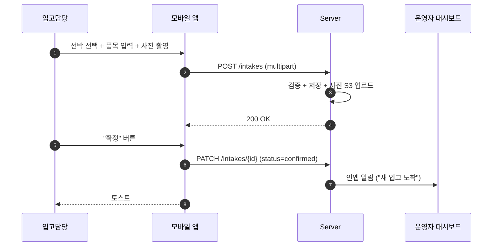
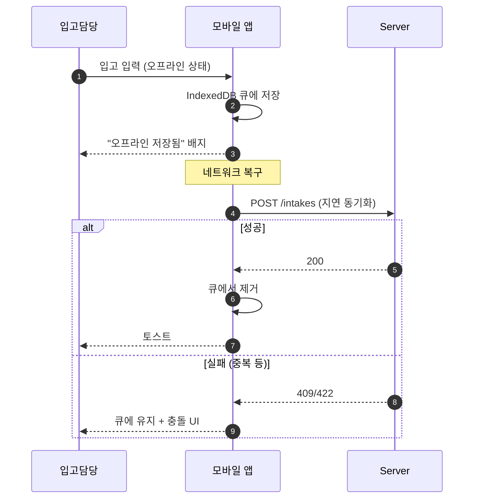
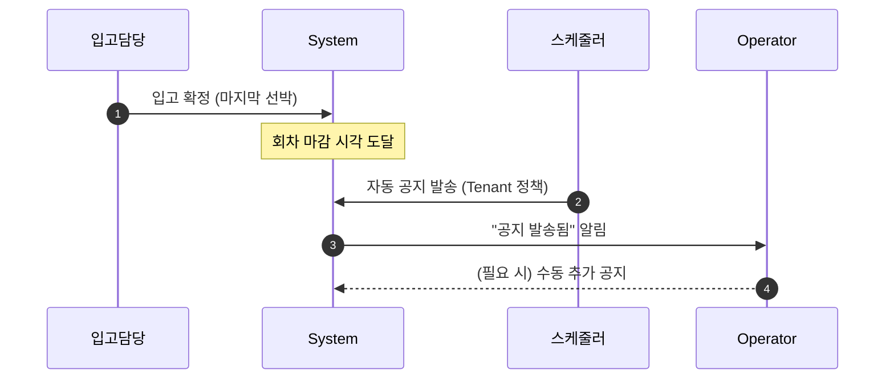
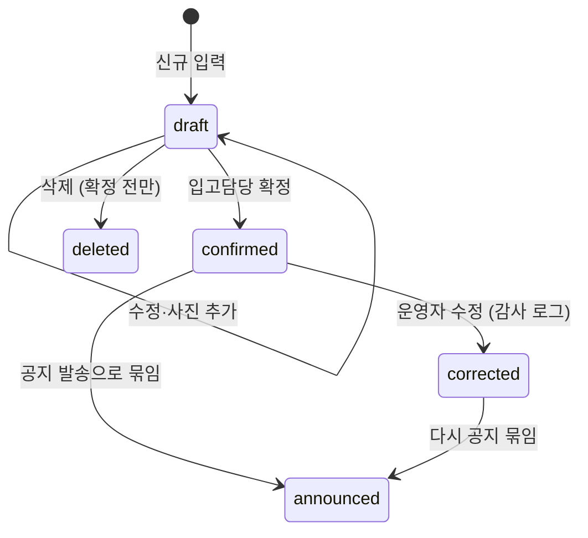

# 03. Receiver (입고담당)

## 요약

- **정의**: 위판장 현장에서 선박 도착 시 입고 정보(어종·중량·등급·사진)를 입력하는 현장 직원
- **권한 스코프**: `Tenant` — 입고 데이터 한정 쓰기 (다른 영역은 권한 없음)
- **디바이스**: **모바일 우선** (현장에서 한 손으로 사용. 통신 불안정 환경 대비 오프라인 캐싱)
- **요구사항 v0.3 § 2 의 "입고 담당자(Receiver)"** 와 동일. 운영자와 겸임 가능 (작은 수협)
- **mockup**: 없음 — 본 명세가 구현 기준

## 책임과 권한

### 할 수 있는 것
- 선박 도착 등록 (선박 마스터에 없으면 새로 추가)
- 입고 품목 입력 (어종·중량·단위·등급·참고·사진)
- 입고 확정 (회차에 묶음)
- 본인이 입력한 입고만 수정 (확정 전)
- 입고 사진 추가/삭제 (확정 전)

### 못 하는 것
- 공지 발송, 개찰, 정산 등 운영 행위
- 확정된 입고 수정 (Operator·Admin 만 가능, 감사 로그)
- 다른 Receiver 가 입력한 입고 수정
- 사용자 관리, 설정 변경

## 유스케이스 매핑

| UC | 본 역할의 관여 |
|----|----------------|
| UC-01 입고 등록 | **주관** — 현장 입력 |
| (간접) UC-02 | 입고 확정 시점이 공지 트리거가 됨 |

## 화면 목록

| 화면 | URL | mockup |
|------|-----|--------|
| 입고 메인 | `/t/{code}/receiver` | 없음 |
| 신규 입고 (회차 시작) | `/t/{code}/receiver/new` | 없음 |
| 입고 상세/편집 | `/t/{code}/receiver/intake/{id}` | 없음 |
| 사진 촬영·갤러리 | (모달) | 없음 |
| 오프라인 큐 | `/t/{code}/receiver/offline-queue` | 없음 |

## 각 화면 상세

### 입고 메인

**진입 경로**: 로그인 → Tenant 자동 선택 → `/t/{code}/receiver`

**표시 데이터**
- 상단: 오늘 회차 정보 (회차 번호, 마감 시각 카운트다운)
- "오늘 등록한 입고" 카드 리스트: 선박·어종·총 중량·확정 상태
- "도착 예정 선박" — 사전 등록된 입항 예정 (있으면)
- "+ 새 입고" 큰 버튼 (FAB)
- 오프라인 큐 배지 (동기화 대기 N건)

**가능한 액션**
- "+ 새 입고" → 신규 입고 화면
- 카드 클릭 → 상세/편집
- 오프라인 큐 배지 클릭 → 큐 화면

### 신규 입고

**플로우** (단일 페이지, 단계별)

1. **선박 선택**
   - 검색 또는 최근 선박 리스트
   - "+ 신규 선박" → 인라인 추가
2. **물품 추가** (반복)
   - 어종 선택 (자주 쓰는 어종 상단 노출)
   - 중량 입력 (kg)
   - 단위 선택 (kg/box/ea)
   - 등급 선택 (A/B/C)
   - 참고 (선택)
   - **사진 첨부** (카메라 즉시 호출 권장)
3. **확정** → 회차에 묶임

**입력 필드 (선박 신규)**

| 필드 | 타입 | 필수 | 검증 | 예시 |
|------|------|------|------|------|
| 선박명 | text | ✓ | 2~30자 | 제3만선호 |
| 선주 | select (Tenant 등록 선주) | ✓ | active | 박성진 |
| 어선 번호 | text | ☐ | — | KR-1234 |

**입력 필드 (입고 품목)** — `02-operator.md` 의 입고 등록과 동일하나 모바일 입력에 최적화

| 필드 | 타입 | 필수 | 검증 | 예시 |
|------|------|------|------|------|
| 어종 | select | ✓ | 공유 마스터 | 고등어 |
| 중량 | number | ✓ | > 0 | 320 |
| 단위 | enum | ✓ | kg/box/ea | kg |
| 등급 | enum | ✓ | A/B/C | A |
| 참고 | text | ☐ | 100자 이내 | 활어 |
| 사진 | image (camera, multi) | ☐ (권장 1장 이상) | 각 5MB 이하 | — |

### 입고 상세/편집

**표시 데이터**
- 선박·회차·등록 시각
- 품목 카드 리스트 (사진 썸네일 포함)
- 확정 여부 배지

**가능한 액션**
- 확정 전: 품목 추가/삭제/수정, 사진 추가
- 확정 후: 읽기만 (수정 요청은 Operator/Admin 에게 별도 연락 필요)

### 사진 촬영 (모달)

**가능한 액션**: 카메라 즉시 호출, 갤러리에서 선택, 다중 선택

- 압축: 클라이언트에서 1920px 폭으로 리사이즈 후 업로드 (네트워크 비용 절감)
- EXIF 일부(위치·시각) 유지 — 분쟁 시 증빙
- 업로드 실패: 오프라인 큐로

### 오프라인 큐

**진입 경로**: 입고 메인 → 배지 클릭

**표시 데이터**: 동기화 대기 중인 입고 N건. 각 카드에 선박·품목 요약·실패 사유

**가능한 액션**
- "지금 동기화 시도"
- 개별 카드 → 다시 시도 / 삭제

## 상호작용 흐름

### 정상 입고 (온라인)

### 오프라인 입고 → 후속 동기화

### 입고 확정 → 운영자 공지 발송 트리거 (자동)

## 상태 머신 — 입고(Intake)

## 알림 수신

| 이벤트 | 채널 | 트리거 |
|--------|------|--------|
| 회차 마감 임박 (입고 마감) | 인앱 | 스케줄러 |
| 본인 입고에 운영자가 수정 사항 추가 | 인앱 | Operator 가 corrected |
| 오프라인 큐 동기화 실패 | 인앱 (디바이스 로컬) | 클라이언트 |

## 데이터 가시성

- 자신의 Tenant의 입고 데이터 (본인 + 다른 Receiver의 입고를 읽기로 볼 수 있음, 회차 충돌 방지)
- 수정은 본인 입고만 (확정 전)
- 공지·입찰·정산 데이터는 접근 불가

## 오프라인 캐싱 정책 (요구사항 § 5)

- IndexedDB 에 입고 입력·사진을 큐로 보관
- 네트워크 복구 시 자동 동기화 (background sync API 또는 앱 포그라운드 진입 시)
- 충돌 시 사용자에게 명시: "이 입고는 이미 확정되었습니다 — 새 입고로 등록"

## Open

- 사진 EXIF 위치 사용 — 위판장 GPS 범위 외부 입력 시 경고 UI 도입?
- 오프라인 큐의 최대 보관 기간 (배터리 부담 vs 안정성)
- 한 Receiver 가 여러 회차 동시 입력 가능한지 (현실적으로는 회차 마감 후만)
- 어선 번호 강제 여부 (어업면허번호 표준 확인 필요)

---

**결정**: 화면 5개, 상태 머신, 오프라인 큐 정책.
**Open**: 위 절.
