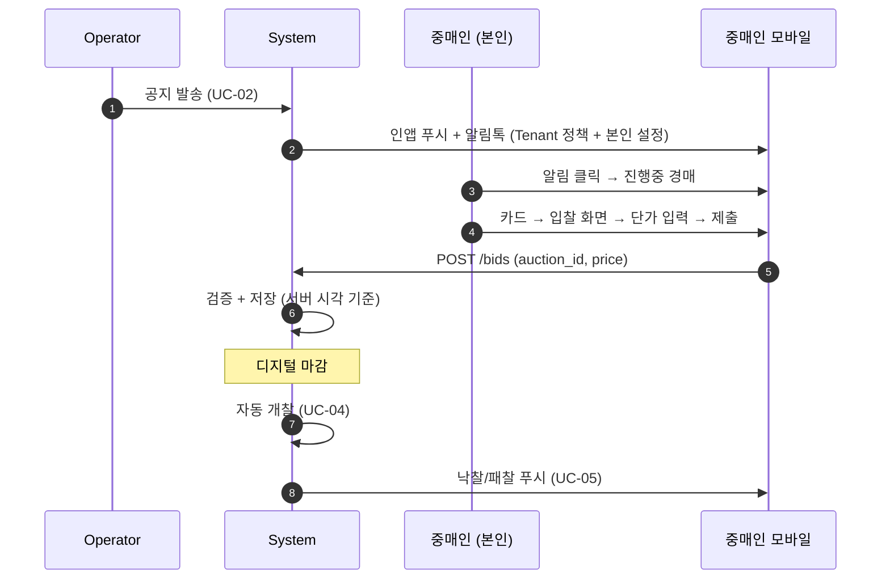
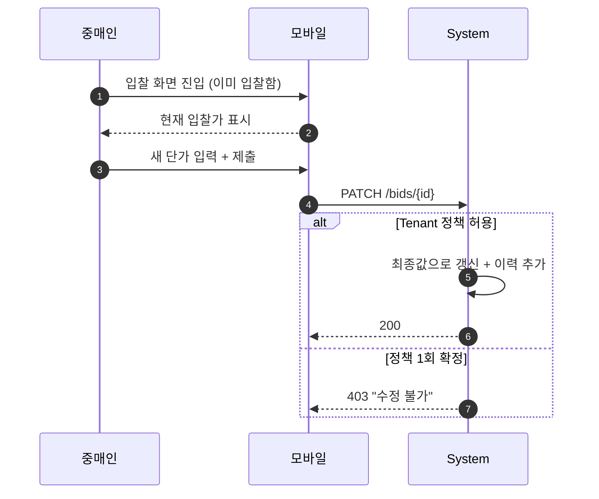
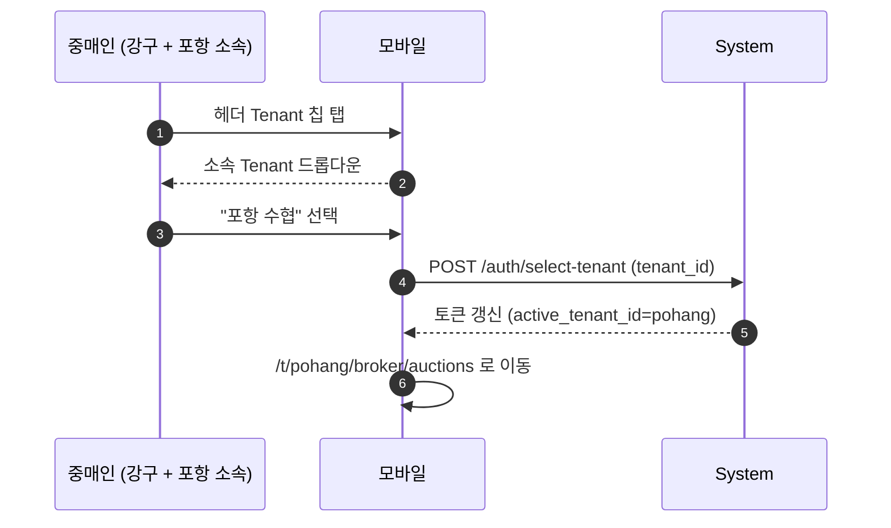
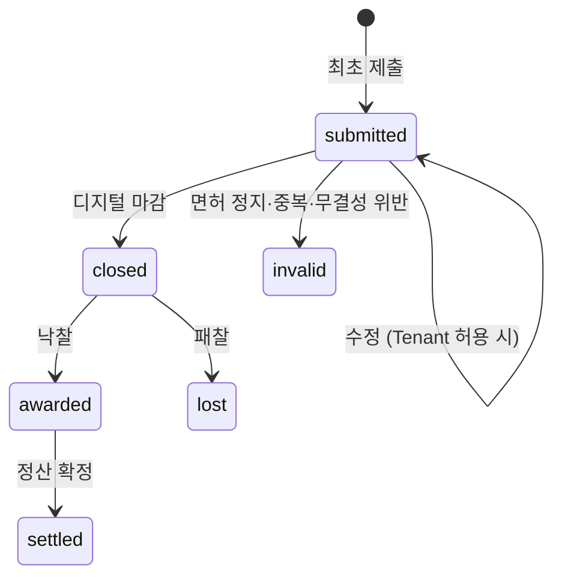

# 04. Broker (중매인)

## 요약

- **정의**: 수협 면허를 보유하고 입찰에 참여하는 중매인
- **권한 스코프**: `Tenant + Self` — Tenant 의 진행중 경매 조회 + 본인 입찰·낙찰·정산
- **디바이스**: **모바일 우선** (현장 이동 중 사용, PWA 또는 네이티브 앱)
- **다중 소속**: 한 사용자가 여러 수협 면허 보유 가능 — 헤더 전환으로 Tenant 별 분리
- **mockup**: 3개 페이지 존재

## 책임과 권한

### 할 수 있는 것
- 진행중 경매 조회
- 본인 입찰 (밀봉)
- 마감 전 본인 입찰 수정 (Tenant 정책에 따라 — `Tenant.bid_modification_allowed`)
- 본인 입찰 내역·낙찰 결과·정산 내역 조회
- 본인 알림 수신 설정

### 못 하는 것
- 다른 중매인의 입찰가 조회 (디지털 마감 전후 모두)
- 입고/공지/개찰/정산 운영
- 본인 외 사용자의 데이터 조회
- 면허 정지/취소 상태에서 입찰

## 유스케이스 매핑

| UC | 본 역할의 관여 |
|----|----------------|
| UC-02 공지 수신 | 알림으로 수신 |
| UC-03 입찰 | **주관** |
| UC-05 결과 통보 | 낙찰/패찰 알림 수신 |
| UC-06 정산 (Self) | 본인 청구액 조회 |

## 화면 목록

| 화면 | URL | mockup |
|------|-----|--------|
| 진행중 경매 | `/t/{code}/broker/auctions` | `docs/broker/auctions.html` |
| 입찰 화면 | `/t/{code}/broker/bid/{auction_id}` | `docs/broker/bid.html` |
| 내 입찰 결과 | `/t/{code}/broker/results` | `docs/broker/results.html` |
| 내 정산 내역 | `/t/{code}/broker/settlement` | 없음 |
| 마이페이지 | `/t/{code}/broker/my` | mockup 미구현 (alert) |
| 알림함 | `/t/{code}/notifications` | 공통 컴포넌트 |

## 각 화면 상세

### 진행중 경매 `[mockup: docs/broker/auctions.html]`

**진입 경로**: 로그인 → Tenant 자동 선택 (단일 소속) 또는 선택 (다중)

**표시 데이터**
- 상단 상태 배너: 회차 정보, 디지털 마감 카운트다운 (실시간 업데이트, 서버 시각 기준)
- 어종 필터 칩
- 경매 카드 리스트: 어종·등급·선박·중량·단위·남은 시간 카운트다운
- 본인이 이미 입찰한 경매: 카드에 "입찰함 ✓" 배지

**가능한 액션**
- 어종 필터
- 카드 클릭 → 입찰 화면
- "내 입찰" 탭으로 전환 (하단 탭)

### 입찰 화면 `[mockup: docs/broker/bid.html]`

**진입 경로**: 진행중 경매 → 카드 클릭

**표시 데이터**
- 물품 상세: 어종·등급·선박/선주·중량·단위·참고·사진 갤러리
- 카운트다운 (마감까지)
- 밀봉 입찰 안내 (Tenant 정책 노출 — 동일가 처리, 수정 허용 여부)
- 본인이 이전에 입찰했으면 현재 입찰가 표시

**가능한 액션**
- 단가 입력
- 빠른 가격 버튼 (시세 추천 — 최근 N회 낙찰가 평균 ± 옵션)
- **"입찰하기"** → confirm 모달 → 제출
- 수정 입찰: 마감 전 동일 화면에서 재입력 가능 (Tenant 정책 `bid_modification_allowed=true` 일 때만)

**입력 필드**

| 필드 | 타입 | 필수 | 검증 | 예시 |
|------|------|------|------|------|
| 입찰가 | number (단위/{auction.unit}) | ✓ | > 0, Tenant 최저가(예가) 이상 | 9000 |
| 메모 | text | ☐ | 50자 | (개인 메모) |

**총액 미리보기**: `입찰가 × 중량 (또는 박스 수 × 환산 중량)` 자동 계산

**확인 모달 내용**
- "kg당 9,000원 × 320kg = 2,880,000원으로 입찰하시겠습니까?"
- 마감 전까지 수정 가능 안내
- 강한 인증 (OTP) — Tenant 설정에 따라

**출력/응답**
- 성공: 토스트 + 내 입찰 결과 페이지로 이동
- 실패: 마감됨/면허 정지/네트워크 → 에러 메시지

### 내 입찰 결과 `[mockup: docs/broker/results.html]`

**표시 데이터**
- 상단 카드: 오늘 낙찰 건수·총액
- 필터 탭: 전체 / 낙찰 / 패찰
- 결과 카드 리스트:
  - 낙찰: 내 입찰가 = 낙찰가, 인수 안내 (시각·장소)
  - 패찰: 내 입찰가 vs 낙찰가, 낙찰자 (선택적 익명 처리 옵션)

**가능한 액션**
- 필터 전환
- 카드 클릭 → 상세 (이전 입찰 이력·사진·정산 연결)

### 내 정산 내역 [mockup 없음 — 구현 필요]

**표시 데이터**
- 기간별 낙찰 총액·중매수수료·청구액
- 정산서 PDF 다운로드 (Tenant 정산 확정 후 발급)
- 미납·완납 상태 (회계 시스템 연동 시)

### 마이페이지

- 본인 프로필 (이름·전화·이메일)
- 면허 정보 (Tenant 단위) — 다중 소속자는 모든 Tenant 의 면허 표시
- 알림 설정 (인앱/알림톡/SMS 개별 토글)
- 비밀번호 변경, 본인 인증 강도(MFA) 설정
- 로그아웃

## 상호작용 흐름

### 공지 수신 → 입찰 → 낙찰 통보

### 입찰 수정 (Tenant 정책 허용 시)

### 다중 소속자의 전환

## 상태 머신 — 입찰(Bid)

## 알림 수신

| 이벤트 | 채널 | 트리거 | 본인 설정 가능 |
|--------|------|--------|----------------|
| 새 경매 공지 | 인앱 + 알림톡 | UC-02 발송 | ✓ (채널) |
| 디지털 마감 임박 (5분 전) | 인앱 | 스케줄러 | ✓ |
| 본인 입찰 등록 확인 | 인앱 | 입찰 직후 | ☐ (필수) |
| 본인 낙찰 | 인앱 + 알림톡 | 개찰 완료 | ☐ |
| 본인 패찰 | 인앱 | 개찰 완료 | ✓ (인앱 끄기 가능) |
| 정산서 발급 | 인앱 + 이메일 | Operator 확정 | ✓ (이메일 끄기) |
| 면허 만료 임박 | 인앱 + 알림톡 | 스케줄러 | ✓ |

## 데이터 가시성

- 활성 Tenant 의 진행중 경매 (모두 조회 가능)
- 본인 입찰 (자신의 입찰만, 다른 중매인의 입찰가는 영구 비공개)
- 본인 낙찰/정산 (Self)
- 다른 Tenant 데이터: 헤더 전환 후 진입

## 다중 소속자 UX

- 헤더에 Tenant 칩 (현재 활성) + ▾
- 알림함은 통합 (모든 Tenant), 단 각 알림에 Tenant 라벨
- 알림 클릭 → 해당 Tenant 로 자동 전환 + 해당 페이지로 이동

## mockup ↔ 본 명세 차이

| 항목 | mockup | 본 명세 | 비고 |
|------|--------|---------|------|
| Tenant 칩 | 없음 (단일) | 헤더에 표시 + 다중 시 ▾ | Phase 4 |
| 입찰 수정 정책 | "수정 가능" 텍스트 (하드코딩) | Tenant.bid_modification_allowed 동적 | Phase 3 |
| 정산 내역 화면 | mockup 미구현 | 구현 필요 | — |
| 마이페이지 | alert() 만 | 구현 필요 (면허·알림 설정) | — |
| 알림 설정 | 없음 | 마이페이지에서 채널별 토글 | — |
| 강한 인증 | 없음 | 입찰 시 OTP (Tenant 정책) | Phase 2 |
| 카운트다운 | 클라이언트 시각 | **서버 시각 동기화** 필수 | 핵심 — § 5 |

## 단일 소속 vs 다중 소속

- 단일 소속자: 헤더 Tenant 칩 텍스트만, 전환 UI 없음 — mockup 과 동일
- 다중 소속자: 칩 ▾ 드롭다운, 다른 Tenant 의 알림 통합함

## Open

- 시세 추천 알고리즘 (최근 N일 평균 vs ARIMA 등 통계 모델)
- 패찰 시 낙찰자 노출 — 익명 vs 면허번호 표시 (Tenant 정책 도입?)
- 입찰 수정 횟수 제한 (무제한 vs 5회 등)
- 본인 인증 강도(MFA): 입찰 매번 vs 디바이스 등록 후 생략

---

**결정**: 화면 6개, 입찰 상태 머신, 다중 소속 UX, mockup 차이 분석.
**Open**: 위 절 + 시세 추천 정책은 별도 검토.
