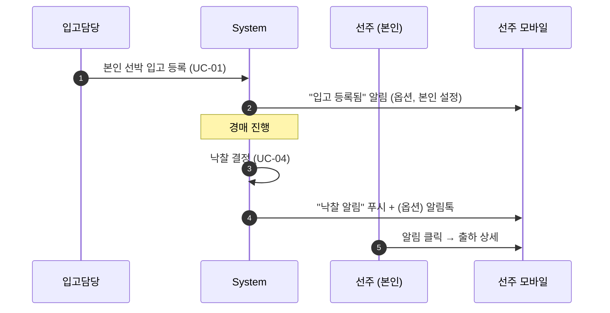
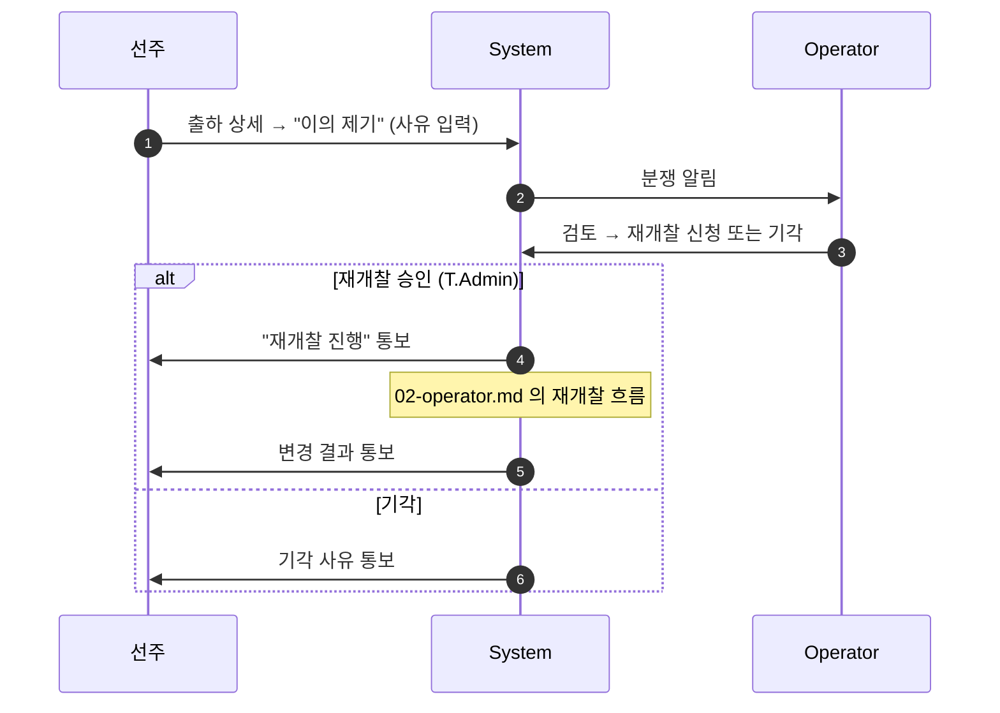
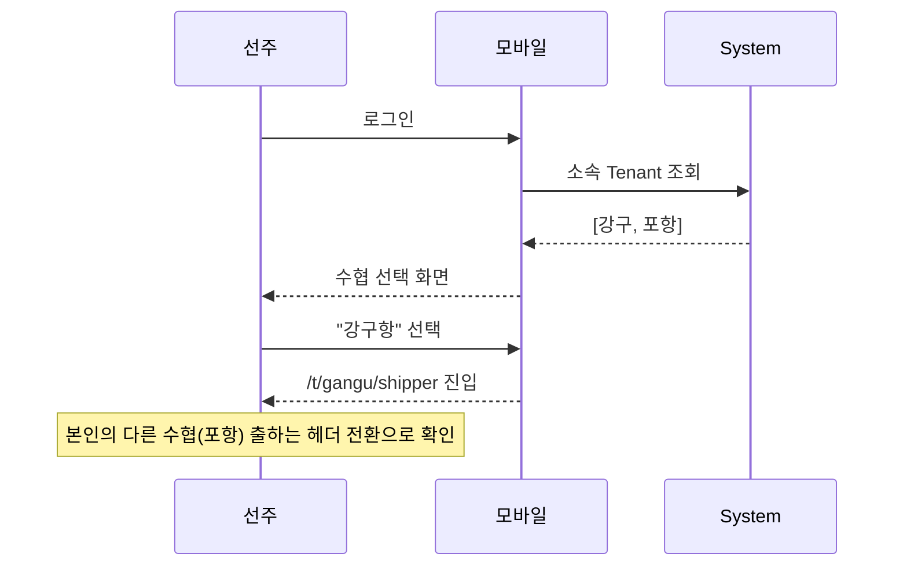
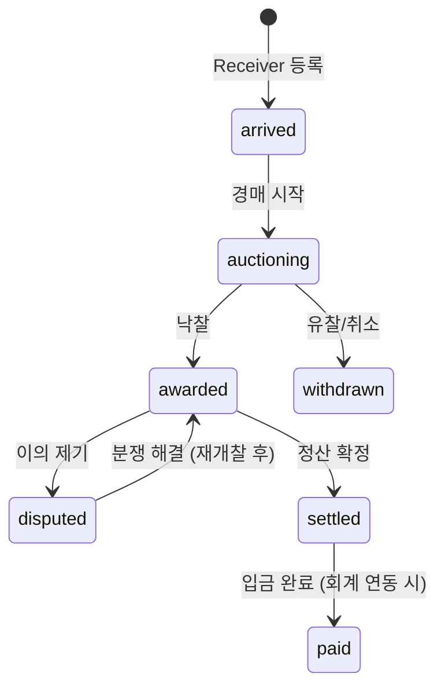

# 05. Shipper (선주)

## 요약

- **정의**: 어선을 보유하고 본인 명의로 출하한 수산물의 낙찰·정산 결과를 조회하는 사용자
- **권한 스코프**: `Self` 위주 — 본인이 출하한 데이터에 한정. 다른 선주 데이터는 접근 불가
- **디바이스**: **모바일 우선** (현장 이동, 어업 종사자의 사용 환경 고려)
- **다중 소속**: 한 사용자가 여러 수협에 본인 명의 선박을 등록 가능
- **mockup**: 없음 — 본 명세가 구현 기준

## 책임과 권한

### 할 수 있는 것
- 본인 명의 선박의 출하 이력 조회
- 본인 출하의 낙찰 결과 조회
- 본인 정산서 조회·다운로드
- 본인 프로필 (연락처) 일부 수정
- 알림 설정 (채널별 토글)

### 못 하는 것
- 입고 등록 (Receiver 가 수행)
- 입찰 (Broker 권한)
- 다른 선주의 데이터 조회
- 본인 선박의 면허/소유권 정보 수정 (Admin 권한, 별도 절차)

## 유스케이스 매핑

| UC | 본 역할의 관여 |
|----|----------------|
| UC-02 공지 수신 | 본인 출하분이 포함된 회차 공지 수신 (참고용) |
| UC-05 결과 통보 | **주요 수신자** — 본인 물품의 낙찰 결과 |
| UC-06 정산 (Self) | 본인 지급액·수수료 내역 조회 |
| UC-08 통계 (Self) | 본인 출하 실적 |

## 화면 목록

| 화면 | URL | mockup |
|------|-----|--------|
| 출하 메인 | `/t/{code}/shipper` | 없음 |
| 선박별 출하 이력 | `/t/{code}/shipper/vessels` | 없음 |
| 출하 상세 (입고 1건) | `/t/{code}/shipper/intake/{id}` | 없음 |
| 정산 내역 | `/t/{code}/shipper/settlement` | 없음 |
| 알림함 | `/t/{code}/notifications` | 공통 컴포넌트 |
| 마이페이지 | `/t/{code}/shipper/my` | 없음 |

## 각 화면 상세

### 출하 메인

**진입 경로**: 로그인 → Tenant 자동/선택 → `/t/{code}/shipper`

**표시 데이터**
- 상단 카드: 오늘 출하 건수·총 중량·예상 지급액
- "오늘 출하" 카드 리스트 (입고 단위)
  - 선박·어종·중량·상태 (입고완료 / 경매중 / 낙찰 / 정산대기 / 정산완료)
- "최근 7일" 요약 카드
- 알림 벨 (미확인 수)

**가능한 액션**
- 카드 클릭 → 출하 상세
- "선박별 보기" → 선박 이력 화면
- 하단 탭: 출하 / 정산 / 마이

### 선박별 출하 이력

**표시 데이터**
- 본인 명의 선박 카드 리스트 (다중 선박일 때)
- 선박 선택 → 해당 선박의 출하 이력 타임라인
  - 일자 그룹 → 각 일자 안에 어종별 출하·낙찰가·금액

**가능한 액션**
- 기간 필터 (오늘/7일/30일/사용자 지정)
- 어종 필터
- CSV 다운로드 (본인 데이터 한정)

### 출하 상세

**진입 경로**: 메인 카드 또는 선박 이력 → 입고 1건 클릭

**표시 데이터**
- 입고 정보: 도착 시각·어종·중량·등급·참고·사진
- 경매 진행: 경매번호·입찰자 수·디지털 최고가·현장 최고가·최종 낙찰가
- 낙찰자: 면허번호 표시 (개인정보는 미공개)
- 지급액 미리보기: 낙찰가 - 위판수수료 = 본인 지급액 (Tenant.fee_policy 기준)
- 사진 갤러리 (Receiver 가 첨부)

**가능한 액션**
- 사진 확대
- "이의 제기" → 분쟁 모달 (사유 입력 → 운영자에게 전달, UC-05 분쟁 트리거)

### 정산 내역

**표시 데이터** (월별 또는 기간 선택)
- 표: 일자·선박·어종·낙찰가·수수료·지급액·상태
- 합계 카드: 기간 총 지급액·총 수수료
- 정산서 다운로드 (PDF) — Operator 가 확정한 정산만

**가능한 액션**
- 기간 선택
- PDF 다운로드
- "회계 시스템 입금 확인" 링크 (옵션, 수협 정책)

### 마이페이지

- 프로필: 이름·전화·이메일·계좌 (정산 입금 계좌)
- 본인 선박 목록 (등록·갱신은 Admin 권한)
- 알림 설정: 채널별 토글, 어떤 이벤트만 받을지 (낙찰 즉시 / 일일 요약 등)
- 비밀번호·MFA

## 상호작용 흐름

### 입고 → 낙찰 통보 (선주 관점)

### 이의 제기 → 운영자 처리

### 다중 수협 소속 선주

## 상태 머신 — 본인 출하(Shipper 관점의 입고 상태)

## 알림 수신

| 이벤트 | 채널 | 트리거 | 본인 설정 |
|--------|------|--------|-----------|
| 본인 선박 입고 등록 | 인앱 | Receiver 등록 시 | ✓ (옵션) |
| 경매 시작 | 인앱 | 공지 발송 (UC-02) | ✓ |
| 본인 출하 낙찰 | 인앱 + 알림톡 | UC-05 | ☐ (필수) |
| 유찰 | 인앱 + 알림톡 | UC-05 | ☐ |
| 정산 확정 | 인앱 + 이메일 | UC-06 | ✓ (이메일 옵션) |
| 입금 완료 | 인앱 | 회계 연동 응답 | ✓ |
| 이의 제기 처리 결과 | 인앱 + 알림톡 | Operator 처리 | ☐ |

## 데이터 가시성

- 본인 명의 선박의 데이터에만 접근 (`shipper_user_id = self`)
- 동일 회차의 다른 선주 데이터: 접근 불가
- Tenant 전체 통계: 본인 비중 %만 표시 (Open — `06-open-questions.md` 참고)

## 다중 소속 처리

- 선주가 여러 수협에 본인 명의 선박 등록: 각 Tenant 별 Membership(`role=shipper`)
- 통합 출하 보기는 본 명세 단계에선 미지원 — 헤더 Tenant 전환으로 각각 조회

## Open

- 통합 정산 보기 (모든 수협 통합 합계) — UX 도입 시 수수료율 차이 처리 (`06-open-questions.md B1`)
- 이의 제기의 시한 (낙찰 후 N시간 이내 vs 다음 정산 확정 전)
- 선박 소유권 변경(거래 등) 처리 — Admin 직접 vs 선주 신청 + Admin 승인
- 입금 계좌 변경 — 본인 단독 vs 본인 인증 + Admin 통지

---

**결정**: 화면 6개, 출하 상태 머신, 이의 제기 흐름.
**Open**: 위 절.
