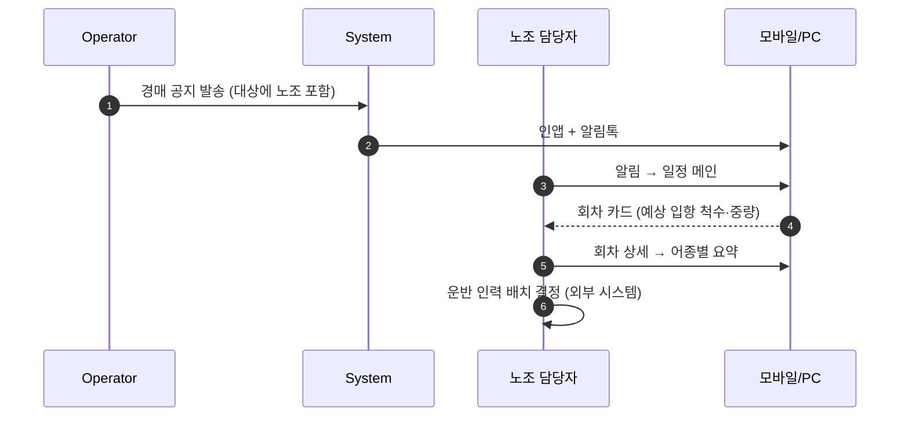
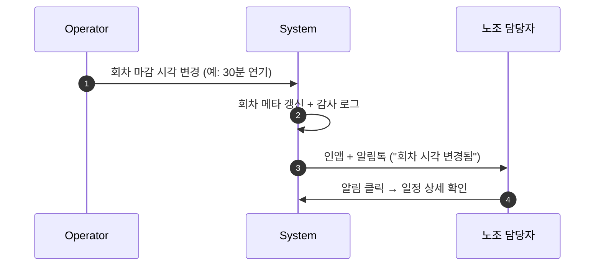
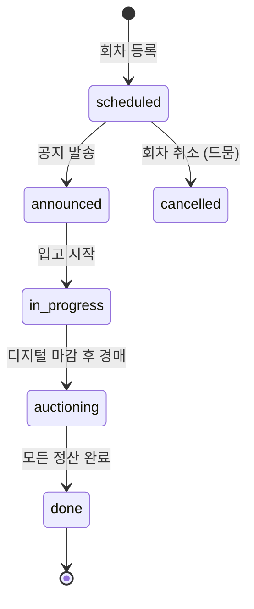

# 06. Union (노조)

## 요약

- **정의**: 어업 노조의 운반·하역 작업 준비를 위해 입항·경매 일정을 미리 조회하는 사용자
- **권한 스코프**: `Tenant` — 일정 조회 위주 (읽기). 본인이 속한 작업조의 작업량 통계는 조회 가능
- **디바이스**: 모바일·데스크톱 모두 (사무실 PC + 현장 모바일)
- **mockup**: 없음 — 본 명세가 구현 기준
- **참고**: 요구사항 v0.3 § 2 의 "노조(Union)" 와 동일

## 책임과 권한

### 할 수 있는 것
- 입항·경매 일정 조회 (오늘/내일/주간)
- 입고 품목 요약 조회 (어종·중량) — 운반량 산정용
- 본인이 속한 작업조의 작업량 통계 조회
- 공지 수신 (UC-02 의 노조 대상)
- 일정 변경 알림 수신

### 못 하는 것
- 입고/공지/개찰/정산 등 운영 행위
- 사용자 관리, 설정 변경
- 다른 작업조의 통계 (Self/소속 한정)
- 도메인 데이터 쓰기 (모두 읽기 전용)

## 유스케이스 매핑

| UC | 본 역할의 관여 |
|----|----------------|
| UC-02 공지 수신 | 노조 대상 공지를 수신 (운반 인력 배치) |
| UC-08 통계/리포트 | **본인 소속 작업조의 작업량만** (요구사항 § 4 의 △) |

## 화면 목록

| 화면 | URL | mockup |
|------|-----|--------|
| 일정 메인 (오늘) | `/t/{code}/union` | 없음 |
| 주간 일정 | `/t/{code}/union/schedule` | 없음 |
| 일정 상세 (회차) | `/t/{code}/union/schedule/{round_id}` | 없음 |
| 작업량 통계 | `/t/{code}/union/stats` | 없음 |
| 알림함 | `/t/{code}/notifications` | 공통 컴포넌트 |

## 각 화면 상세

### 일정 메인

**진입 경로**: 로그인 → Tenant 자동/선택 → `/t/{code}/union`

**표시 데이터**
- 오늘 회차 카드 리스트 (회차별)
  - 회차 시각·상태(예정/진행/종료)
  - 입항 선박 수·총 입고 중량 (어종 분포 미니 차트)
- 내일·모레 예정 회차 (있으면)
- 미확인 알림 배지

**가능한 액션**
- 회차 카드 클릭 → 일정 상세
- "주간 일정" 버튼 → 주간 보기

### 주간 일정

**표시 데이터**: 7일 캘린더 — 일자별 회차·예상 입항 척수·예상 어종

**가능한 액션**
- 일자 클릭 → 그날의 회차 목록
- 회차 클릭 → 일정 상세

### 일정 상세 (회차)

**표시 데이터**
- 회차 메타: 일자·회차 시각·디지털 마감·현장 시작 (Phase 2)
- 입항 선박 테이블: 선박명·도착 시각·총 중량 (선주 정보는 비공개 — 운반 산정에 불필요)
- 어종별 요약: 어종·총 중량·단위 (운반량 추정용)
- 작업 인력 배정 메모 (옵션, 노조 내부 메모 — Open)

**가능한 액션**
- "전체 어종 요약 CSV" 다운로드 (운반 계획 외부 도구로)
- "이 회차 알림 받기" 토글 (개인 알림)

### 작업량 통계

**표시 데이터**
- 기간 선택 (오늘/주/월/사용자 지정)
- 본인 소속 작업조의 처리 중량·건수
- 어종별 처리 비중
- 시간대별 분포 (운반 패턴)

**가능한 액션**
- 기간 변경
- CSV 다운로드

## 상호작용 흐름

### 공지 수신 → 일정 확인

### 일정 변경 발생 시

## 상태 머신 — 노조가 보는 회차 상태

> 노조에게는 위 상태가 "운반 작업 예상 시점" 으로 활용된다. 입고가 끝나기 전에 운반 인력 호출.

## 알림 수신

| 이벤트 | 채널 | 트리거 | 본인 설정 |
|--------|------|--------|-----------|
| 회차 공지 (당일/사전) | 인앱 + 알림톡 | UC-02 | ✓ |
| 회차 시각 변경 | 인앱 + 알림톡 | Operator 변경 | ☐ (필수) |
| 회차 취소 | 인앱 + 알림톡 + SMS | Admin/Operator 취소 | ☐ |
| 입항 척수 큰 변동 (당일 +N척 이상) | 인앱 | 자동 임계값 | ✓ |
| 일일 요약 보고서 | 이메일 | 매일 정해진 시각 | ✓ |

## 데이터 가시성

- 자신의 Tenant 의 회차·입고 메타 (수량·어종 중심, 가격·낙찰자 비공개)
- 본인 소속 작업조의 처리량 (Self 스코프 일부)
- 다른 Tenant 데이터: 헤더 전환

### 비공개 정보 (노조에는 노출 X)

- 낙찰가, 입찰가 (분쟁 방지)
- 선주 개인정보 (이름 외)
- 중매인 정보
- 정산 금액

## 다중 Tenant 처리

- 한 노조 담당자가 여러 위판장의 노조 일정을 본다는 시나리오는 흔치 않으나, 가능
- 헤더 전환으로 처리. 통합 일정 보기는 미지원

## Open

- 작업조(squad/team) 모델 도입 여부 — 본 명세는 "본인 소속 작업조" 라고 가정하지만, Tenant 내 작업조 데이터 구조 미정
- 운반 인력 배정 메모를 시스템 내에서 관리할지 vs 외부 도구
- 일일 요약 이메일의 표준 양식 — 노조마다 다른지
- 입고 사진의 노조 노출 — 운반 시 어종 식별에 유용하나 PII 우려

---

**결정**: 화면 5개, 회차 상태 머신, 비공개 정보 명시.
**Open**: 작업조 모델·운반 배정 도구 연계 등.
